En este tema se aborda el análisis bibliométrico como una herramienta esencial para la **gestión del conocimiento en el diseño experimental**, permitiendo identificar tendencias, autores, revistas y enfoques metodológicos relevantes dentro del campo de la microbiología industrial. La inclusión de este capítulo tiene como propósito **fortalecer la fundamentación teórica y metodológica** del lector, proporcionándole una visión panorámica de la producción científica relacionada con el tema. A través del uso de técnicas de minería de datos bibliográficos y del software *R*, se ejemplifica cómo la bibliometría contribuye a **orientar la planificación y optimización de los diseños experimentales**, facilitando la toma de decisiones basadas en evidencia científica actual. De este modo, el capítulo no solo enriquece el marco conceptual del libro, sino que también promueve una práctica investigativa más informada, sistemática y alineada con las tendencias globales en investigación aplicada.

## Etapas del análisis bibliométrico

El análisis bibliométrico es un proceso estructurado que permite examinar de manera sistemática la producción científica sobre un tema determinado. Para garantizar resultados rigurosos y reproducibles, este procedimiento se desarrolla en varias etapas que van desde la **definición del tema y la búsqueda en bases de datos**, hasta la **depuración, análisis e interpretación de los resultados** mediante herramientas especializadas, como *Bibliometrix* y su interfaz *Biblioshiny*.

A continuación, se describen las etapas del proceso:

### Definición del tema y palabras clave

La primera etapa consiste en **delimitar el tema de estudio** y seleccionar las **palabras clave** que representen el objeto de investigación. Por ejemplo, en este ejercicio se emplearon los datos sobre *"el crecimiento de Cordyceps militaris en varios sustratos vegetales"* \].

Algunas palabras clave empleadas fueron:

-   *Cultivation*: proceso de cultivar *Cordyceps militaris* en condiciones controladas para estudiar su crecimiento.

-   *Mycelial growth*: crecimiento del micelio, parte vegetativa del hongo.

-   *Substrate optimization*: mejora de los sustratos de cultivo para maximizar el crecimiento y la producción de metabolitos.

-   *Bioactive compounds*: compuestos bioactivos como la cordicepina, con propiedades medicinales.

-   *Fermentation conditions*: condiciones de fermentación (temperatura, pH, nutrientes) que influyen en el crecimiento del hongo.

Las combinaciones de estas palabras se construyen utilizando **operadores booleanos** (AND, OR, NOT) para lograr ecuaciones de búsqueda precisas.

Por ejemplo:

> `"Cordyceps militaris" AND ("substrate optimization" OR "culture medium") AND "growth"`

### Búsqueda y descarga de información en bases de datos

Una vez definidas las palabras clave, se realiza la **búsqueda sistemática** en bases de datos compatibles con *Bibliometrix*, como: [**Web of Science**](www.webofscience.com) , [**Scopus**](www.scopus.com), [**OpenAlex**](www.openalex.org), [**Dimensions**](www.dimensions.ai), [**The Lens**](www.lens.org); [**PubMed**](https://pubmed.ncbi.nlm.nih.gov/)y [**Cochrane Library**](www.cochranelibrary.com)

Durante esta etapa se deben aplicar filtros de búsqueda: **periodo de tiempo, tipo de documento** (artículo, revisión, conferencia), **área temática.**

Luego, los **metadatos** deben descargarse en formato **CSV, BibTeX o RIS**, según lo admita la base. Por ejemplo, en Scopus puede exportarse como *CSV (UTF-8)*, con la opción "Full Record". Se recomienda nombrar los archivos de forma clara (p. ej. `Cordyceps_Scopus_2025.csv`).

En la Tabla @tbl-busqueda-scopus se presentan los resultados obtenidos a partir de las diferentes ecuaciones de búsqueda formuladas mediante operadores booleanos en la base de datos Scopus®. Estas estrategias permitieron identificar y cuantificar la producción científica relacionada con Cordyceps militaris, facilitando la selección de la ecuación de búsqueda más adecuada para el desarrollo de la revisión bibliográfica.

| Ecuación de búsqueda | Documentos encontrados |
|----|----|
| "Cordyceps militaris" AND ("metabolite" OR "growth conditions" | 225 |
| "Cordyceps militaris" AND ("cordycepin") AND "growth" | 191 |
| "Cordyceps militaris" AND "medium" AND "growth" | 99 |
| "Cordyceps militaris" AND ("substrate optimization" OR "culture medium") AND "growth" | 40 |

: Resultados obtenidos para las diferentes ecuaciones de búsqueda aplicadas en Scopus® sobre la temática de *Cordyceps militaris*. {#tbl-busqueda-scopus}

### Importación y análisis en Bibliometrix / Biblioshiny

Con los archivos descargados, se procede a su análisis mediante *Bibliometrix*, un paquete de R que facilita la recopilación, análisis y visualización de información científica de forma integral [@Aria2017]. En la @tbl-bibliomterix se muestran los módulos de la interfaz *Biblioshiny* que permite ejecutar estos análisis de manera interactiva y sin necesidad de programación. **Bibliometrix** (a través de su interfaz **Biblioshiny**) está estructurado en **8 módulos principales** o menús, y dentro de cada uno hay **submódulos o indicadores específicos**.

| Nº | Módulo | Función general | Submódulos / indicadores |
|---:|----|----|----|
| 1 | **Data** | Importar/cargar bases bibliográficas (Scopus, WoS, PubMed, etc.). | Import or Load; Merge Datasets |
| 2 | **Filters** | Filtrar el corpus por año, tipo de documento, autores, países, palabras clave. | Time Span; Authors; Countries |
| 3 | **Overview** | Panorama general con indicadores descriptivos. | Main Information; Annual Scientific Production; Average Citations per Year; Three-Field Plot |
| 4 | **Sources** | Análisis de revistas/fuentes. | Most Relevant Sources; Bradford's Law |
| 5 | **Authors** | Productividad, impacto y colaboración de autores. | Authors' Production Over Time; Most Cited Authors; Collaboration Network |
| 6 | **Documents** | Documentos más citados y patrones de citación. | Most Cited Documents; Reference Spectroscopy |
| 7 | **Clustering (Conceptual Structure)** | Estructura temática/conceptual del campo. | Co-occurrence Network; Thematic Map; Factorial Analysis |
| 8 | **Social Structure** | Redes de colaboración entre autores, instituciones y países. | Collaboration Network; Country Scientific Production; Collaboration World Map |

: Módulos principales de Bibliometrix / Biblioshiny {#tbl-bibliomterix}

### Interpretación y comunicación de resultados

Los resultados obtenidos se interpretan según el contexto de estudio. En el caso de la **microbiología industrial**, el uso de *Bibliometrix* permite identificar líneas emergentes de investigación, autores influyentes, colaboraciones internacionales y vacíos en la literatura.

A través de las visualizaciones interactivas de *Biblioshiny*, es posible construir **mapas de conocimiento**, **redes de colaboración** y **tendencias temáticas**, que facilitan la toma de decisiones basadas en evidencia científica.\
De esta forma, el análisis bibliométrico se consolida como una herramienta que fortalece la **planificación de proyectos**, la **vinculación académica** y la **comprensión del panorama científico actual** en el campo de la microbiología industrial.

## El paquete [**Bibliometrix**](https://www.bibliometrix.org/home/)

Desarrollado en R, constituye una herramienta clave para el análisis bibliométrico en distintas áreas del conocimiento, entre ellas la [**microbiología industrial**](#0) y el **diseño experimental**. Su enfoque de código abierto permite recopilar, analizar y visualizar información científica de manera integral, ofreciendo una visión clara sobre las principales tendencias y la evolución de la investigación en cada campo [@Aria2017].

En la **microbiología industrial**, [**Bibliometrix**](https://www.bibliometrix.org/home/) se ha convertido en un apoyo fundamental para reconocer **líneas emergentes de investigación**, **colaboraciones internacionales** y **autores influyentes** que marcan el desarrollo del área [@Aria2017]. A través de su interfaz visual [**Biblioshiny**](https://www.bibliometrix.org/home/index.php/layout/biblioshiny), los análisis complejos se vuelven accesibles incluso para quienes no tienen experiencia en programación. Esta accesibilidad favorece la creación de **mapas de conocimiento**, **redes de colaboración** y **agrupamientos temáticos** que ayudan a identificar oportunidades de trabajo conjunto, vacíos en la literatura o la evolución de determinadas técnicas experimentales.

El uso de Bibliometrix y Biblioshiny permite una comprensión argumentada del panorama científico, fomentando decisiones de investigación basadas en evidencia y fortaleciendo la planificación de proyectos dentro de la microbiología industrial.

### Instalación de bibliometrix

Para iniciar el análisis bibliométrico, se procede a ingresar al programa RStudio®, al tiempo que se realiza la instalación de los paquetes: *bibliometrix* y *bibliometrixData*, desde la pestaña de Archivos y Gráficos en la sección de Packages (@fig-Bibliometrix1).

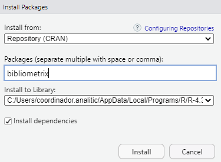{#fig-Bibliometrix1}

Posteriormente, desde la consola de RStudio se digitan y ejecutan los comandos:

> library(bibliometrix)\
> biblioshiny()

También se puede habilitar manualmente en la pestaña de archivos y gráficos de la interfaz de RStudio, pestaña de Packages (@fig-Bibliometrix1) seleccionado las librerías a usar.

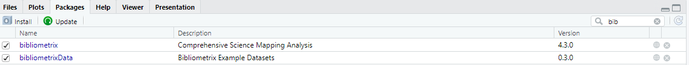{#fig-Bibliometrix2}

Se abrirá el servidor de Bibliometrix (@fig-Figura_9) en el navegador web (Chrome, Mozilla, Edge, entre otros). Es importante aclarar que la interfaz de Bibliometrix únicamente pude ser ejecutada desde RStudio®.

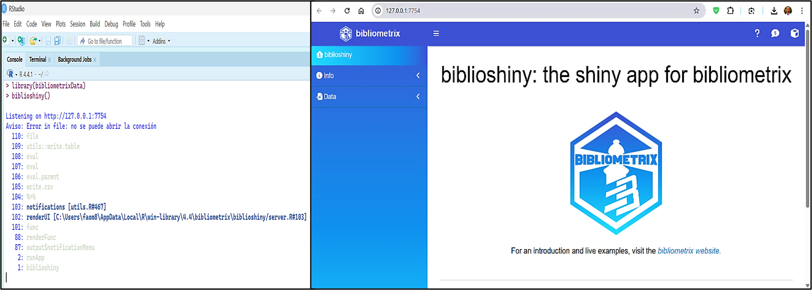{#fig-Figura_9}

En la parte izquierda se despliega el **menú de biblioshiny**, y se procede con la importación en "***Import or Load***" se carga el archivo CSV [@Aria2017], al tiempo que se seleccionan las casillas: ***Import raw file(s*****)**, la procedencia de la base de datos consultada (*Scopus,* en nuestro caso) , junto la opción: ***Surname and Initials***, y finalmente damos click en el botón de ***Start*** (@fig-Figura_10).

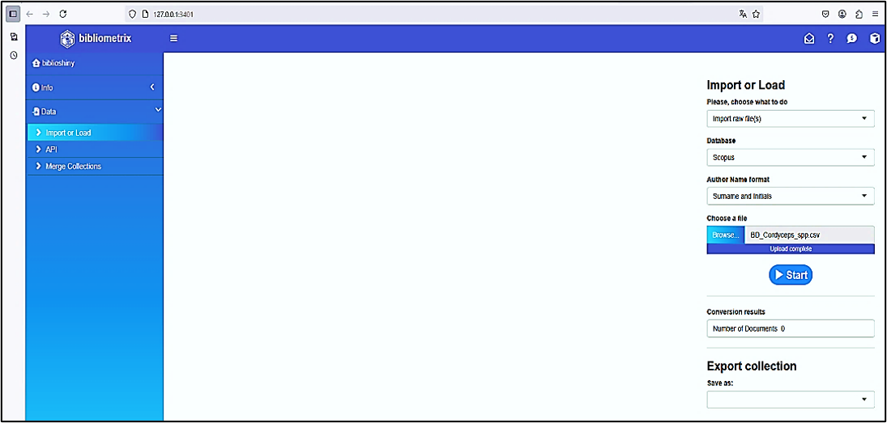{#fig-Figura_10}

Después se despliega una nueva ventana que muestra el estado de los componentes de los metadatos importados desde el archivo CSV (@fig-Figura_11), allí se muestra una tabla que resume la completitud de los metadatos (para nuestro ejemplo: 191 documentos de Scopus),.

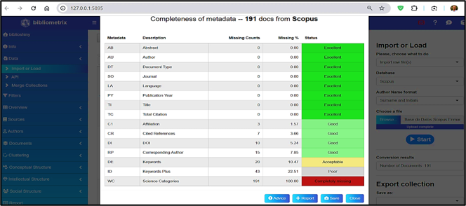{#fig-Figura_11}

Así mismo Bibliometrix evalúa cada uno de los diferentes campos de metadatos (Abstract, afiliación, autor, tipo de documento, etc.) utilizando *junto a* diferentes criterios de clasificación como son: "Excelente", "Bueno", "Aceptable" "Pobre" y "Completamente perdido" (Figura 11), y que al ser cerrado "Close" muestra una tabla dinámica con todos los datos importados incluyendo el DOI, desde el cual se puede acceder y leer directamente el artículo científico (@fig-Figura_12).

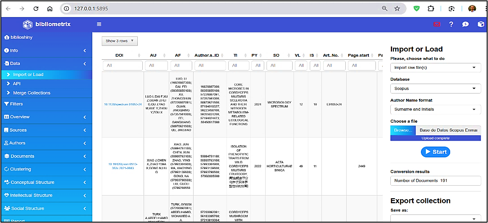{#fig-Figura_12}

### Estructura

#### Modulo Overview

El indicador ***Main information*** muestra los valores de los metadatos trabajados. Para este ejemplo, se tiene un periodo de análisis de 1951 a 2025 con un total de 135 fuentes y 191 documentos; la tasa de crecimiento anual es de 0,94%; **se identificaron 903 autores**, sin registros un solo autor; la coautoría internacional alcanza un valor de 15,18%, y el promedio de **coautores** por documento es de 6,19. Se encontraron 543 palabras clave de autor y 7474 referencias; la edad promedio de los documentos es de 7,34 años, y la cantidad **media de citas por documento** es de 25,69 (@fig-Figura_13).

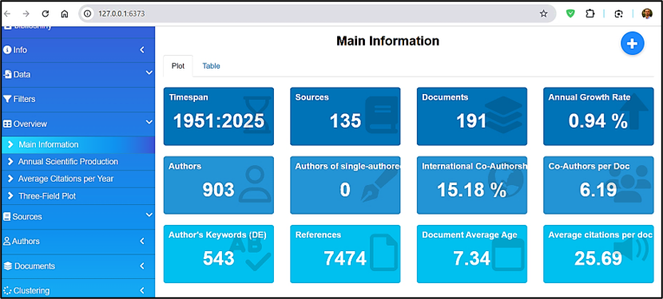{#fig-Figura_13}

Para la sección ***Average Citations Per Ye*****ar** (traducido: citas promedio por año), muestra la evolución de publicaciones sobre *Cordyceps militaris* entre 1951 y 2025 (@fig-Figura_15). Entre **1951 y 2000**, la producción científica fue mínima, con casi nula variación. A partir de **2000**, comienza un crecimiento leve y sostenido, que se **acelera notablemente después de 2010**, alcanzando su punto máximo entre **2020 y 2024**, con más de **20 artículos anuales**. En **2025**, se observa una **caída abrupta**, posiblemente atribuida a datos incompletos o publicaciones aún en proceso. En síntesis, la tendencia general evidencia un **crecimiento exponencial de la investigación** sobre *Cordyceps militaris* en las dos últimas décadas, reflejando su creciente relevancia científica y biotecnológica.

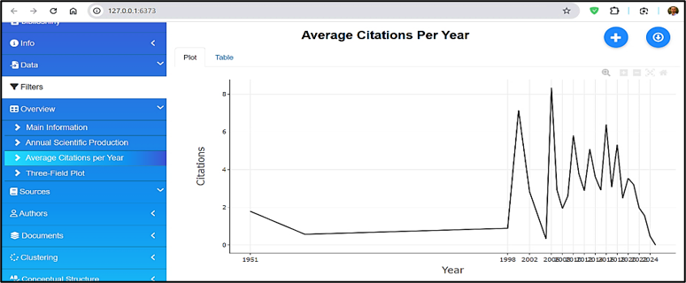{#fig-Figura_15}

La @fig-Figura_16 **"Three-Field Plot"** muestra la relación entre **países (AU_CO)**, **autores (AU)** y **descriptores temáticos (DE)** en la investigación sobre *Cordyceps militaris*. **China** lidera ampliamente la producción científica, seguida por **Tailandia**, **Reino Unido**, **Singapur** y **Estados Unidos**, evidenciando una fuerte concentración asiática en el tema. Los autores más productivos son **Li X**, **Li Y**, **Vongsangnak W** y **Zhang J**, quienes forman redes de colaboración relevantes dentro del campo. En cuanto a los **descriptores**, predominan términos como *Cordyceps militaris*, *biotecnología del hongo*, *compuestos bioactivos* y *análisis transcriptómico*, lo que refleja el enfoque de la investigación en los componentes biológicos y aplicaciones biotecnológicas del hongo. El gráfico confirma el **liderazgo científico de Asia** en el estudio de *Cordyceps militaris* y la *concentración temática en la exploración de compuestos bioactivos y su potencial en salud y biotecnología*.

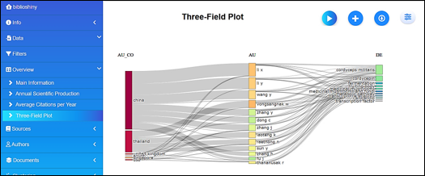{#fig-Figura_16}

## Quarto

#### Modulo Sources

Para el menú de *Sources* en la sección ***Most Relevant Sources*** (traducido: fuentes más relevantes) la producción científica está liderada por: International Journal of Medicinal Mushrooms con 15 artículos publicados, seguido de Mycosystema con 8, le sigue: Applied Microbiology and Biotechnology con 5. Dichas revistas destacan por su enfoque en microbiología, biotecnología y farmacología, áreas clave dentro del estudio abordado como se muestra en la @fig-Figura_17. **La distribución sugiere que la investigación en este campo se encuentra bien representada en revistas especializadas**,las demás revistas como: Biology, Bioresource Technology, y Nutrients, que cuentan con 3 artículos cada una.

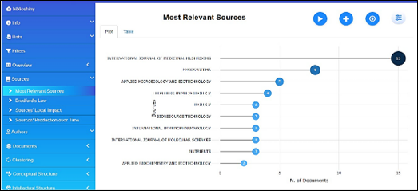{width="656"}{#fig-Figura_17}

En la sección de **Bradford's Law** (traducido: la ley de Bradford) y continuando con nuestro ejemplo didáctico de *Cordyceps mil*itaris ,se observa que: "International Journal of Medicinal Mushrooms", junto con "Mycosystema" y "Applied Microbiology and Biotechnology", conforman el núcleo de fuentes indexadas más relevantes, aportando el mayor número de publicaciones. Estas tres revistas están dentro del área sombreada, lo que **confirma su papel central en la diseminación del conocimiento** sobre *C. militari*s y compuestos bioactivoss. A medida que se avanza hacia la derecha de la @fig-Figura_18, el número de artículos por revista disminuye, lo que representa publicaciones de interés más disperso.

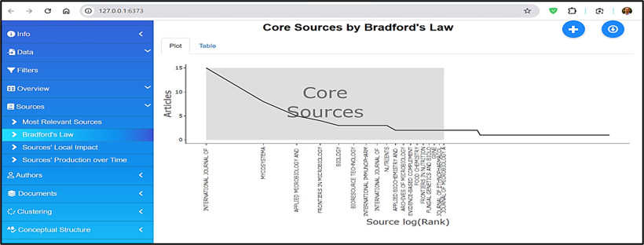{width="662"}{#fig-Figura_18}

#### Modulo Authors

En la sección **"Authors' Production over Time"** (Producción de los Autores a lo Largo del Tiempo) se evidencia que los investigadores **Li X., Li Y. y Wang Y .** han mantenido una **producción científica constante** en los últimos años, alcanzando **picos destacados en 2020 y 2022** (@fig-Figura_19), lo que demuestra su papel central en el estudio de *Cordyceps militaris*. La gráfica muestra una **mayor concentración de publicaciones entre 2019 y 2024**, lo que refleja un **crecimiento sostenido y reciente de la investigación** en este campo. Otros autores, como **Vongsangnak W.**, **Zhang J.**, **Laoteng K.** y **Thanwisai R.**, presentan una participación **más intermitente**, aunque continúan contribuyendo activamente en colaboraciones científicas internacionales. En conjunto, la visualización confirma una **expansión continua de la productividad académica**, impulsada por investigadores consolidados y por el aumento del interés global en las aplicaciones biotecnológicas y farmacológicas del hongo *Cordyceps militaris* .

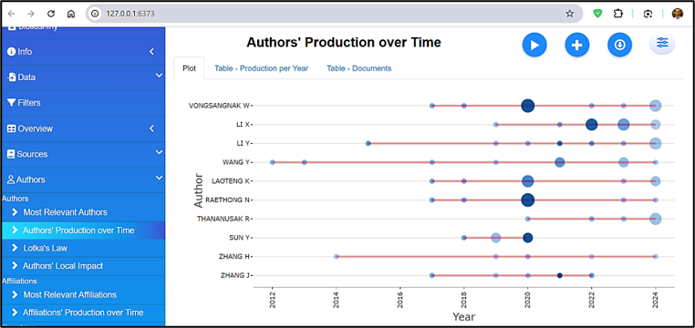{#fig-Figura_19}

Para el menú de *Authors* específicamente en: ***Countries' Scientific Production*** (producción científica de los países), el mapa muestra la distribución geográfica de la producción científica (@fig-Figura_20). China es el país con mayor producción científica (azul oscuro); otros países con destacada producción científica entre los que se incluyen: Estados Unidos, Corea del Sur, Tailandia, Japón, India y varios países europeos y asiáticos (azul celeste). **Algunos países no presentan producción registrada y aparecen coloreados en gris.** En la gráfica se observa que China lidera con 702 publicaciones, seguida por Corea del Sur con 212, Tailandia con 83, Japón con 50 e India con 39. Otros países con menor producción incluyen Estados Unidos con 9, Reino Unido con 8, Alemania con 7, Italia con 6 y Colombia con 5.

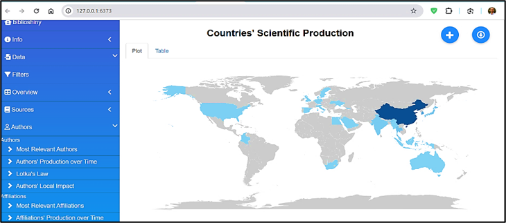{#fig-Figura_20}

#### Modulo Document

En la sección **"Most Frequent Words"** (traducido: palabras más frecuentes) del modulo **Documents**, la visualización identifica los términos que aparecen con mayor recurrencia en la literatura científica sobre *Cordyceps militaris*. Las palabras **"Cordyceps"** y **"Cordycepin"** destacan con **196** y **187** menciones respectivamente, reflejando su relevancia central en los estudios del área. Otros términos con alta frecuencia son **"article"** (109), **"Cordyceps militaris"** (108), **"nonhuman"** (92), **"metabolism"** (79), **"deoxyadenosines"** (77), **"controlled study"** (76), **"deoxyadenosine derivative"** (65) y **"adenosine"** (64). En la @fig-Figura_21, esta la distribución de palabras clave evidencia que la investigación reciente se concentra en los **aspectos bioquímicos y farmacológicos** del hongo, especialmente en torno a sus compuestos activos y su aplicación en estudios experimentales.

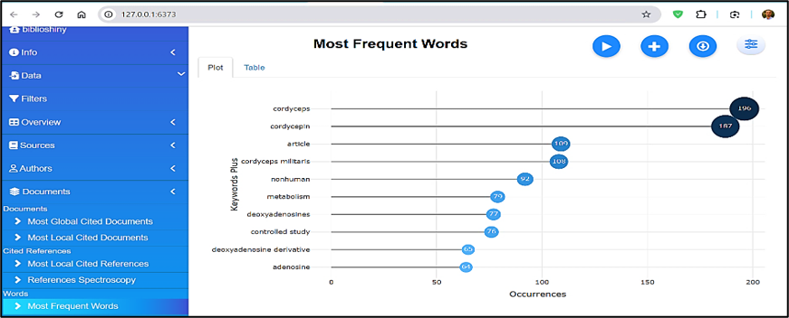{#fig-Figura_21}

En la sección **"Reference Spectroscopy"** (traducido: espectroscopía de referencias) del modulo **Documents**, la visualización muestra la evolución temporal de las **referencias citadas** en estudios de espectroscopia. Antes de **1990**, las citas registradas son casi inexistentes, indicando una actividad investigativa limitada. A partir de **1995**, se observa una **tendencia ascendente constante**, que se intensifica de forma notable hacia **2005**, evidenciando un crecimiento sostenido en la producción científica y en el interés por la temática. El **pico máximo** se alcanza entre **2015 y 2020**, con más de **400 referencias citadas por año**, lo que refleja la consolidación de la espectroscopia como herramienta fundamental en el análisis de compuestos bioactivos, como los del *Cordyceps militaris*. Después de **2018**, se percibe una **disminución progresiva** en las citas (@fig-Figura_22), seguida de una **caída abrupta posterior a 2020**, atribuible al **rezago natural en la citación de estudios recientes**, los cuales aún no han tenido el tiempo suficiente para acumular referencias.

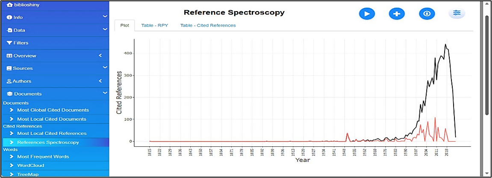{@fig-Figura_22}

#### Modulo Clustering (Conceptual Structure)

Para el menú de *Conceptual Structure* concretamente en: ***Co-occurrence Network*** (traducido: red de coocurrencias), la red se encuentra claramente dividida en dos comunidades principales, identificadas por los colores rojo y azul. **La comunidad roja**, dominada por términos como cordycepin, C*ordyceps militaris*, metabolism y article, se orienta al estudio bioquímico y farmacológico del compuesto, mientras que **la comunidad azul** está asociada a modelos experimentales, destacando términos como animal experiment, human, mouse y cell line. Esta segmentación temática sugiere una dualidad en la línea de investigación: una centrada en la caracterización química y otra en los efectos biológicos en modelos preclínicos (@fig-Figura_23). El análisis de centralidad (como grado y betweenness), permitiría identificar términos puente como: nonhuman o controlled study, que conectan ambas comunidades.

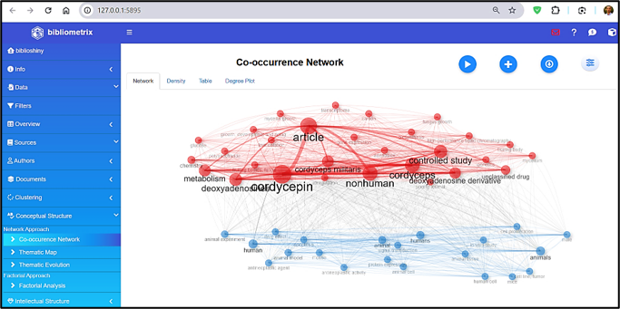{#fig-Figura_23}

En el menú **Conceptual Structure**, específicamente en la opción **Factorial Analysis**, se presenta una gráfica bidimensional de los términos más relevantes identificados en el corpus bibliográfico analizado. En el **eje X (Dim 1)**, que explica el **50,18% de la variabilidad**, se agrupan términos estrechamente relacionados con **estudios experimentales in vivo e in vitro**, tales como *in vitro study*, *mouse*, *animal tissue* y *protein expression*, ubicados en el cuadrante inferior derecho. Este agrupamiento sugiere una fuerte carga temática asociada a **investigaciones biomédicas y farmacológicas**. Por su parte, el **eje Y (Dim 2)**, que explica un **9,68% adicional de la variabilidad**, concentra términos como *transcriptome* y *carbon*, vinculados a **estudios genéticos y metabólicos**, los cuales se encuentran espacialmente separados del resto de la nube léxica.

Esta segmentación espacial evidencia la existencia de **subdominios temáticos diferenciados** dentro del campo de estudio de los *Cordyceps* y sus derivados (@fig-Figura_24), revelando un **enfoque dual**: uno orientado hacia la **bioquímica y biotecnología del hongo**, y otro centrado en los **ensayos experimentales en organismos modelo**.

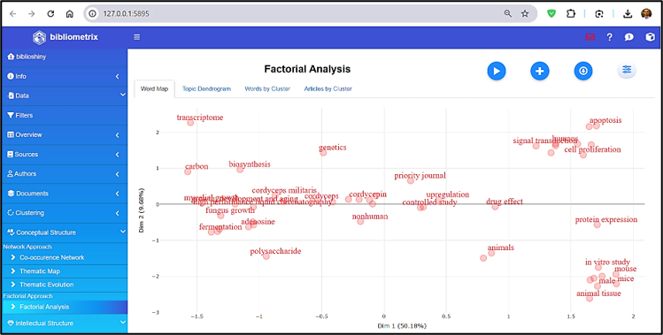{#fig-Figura_24}

#### Social Structure

En **Social Structure**, específicamente en la opción **Collaboration Network**, se presenta un análisis basado en **redes de coautoría**, las cuales, según [@Aria2017], permiten identificar **patrones de colaboración y productividad científica** entre los autores. En el contexto del estudio sobre *Cordyceps militaris*, la figura muestra una **red de colaboración entre investigadores**, donde **cada nodo representa un autor** y **las líneas o aristas** indican la existencia de coautoría en publicaciones científicas.

Se observan **múltiples grupos o comunidades de colaboración**, diferenciados por colores, lo que evidencia la existencia de **subgrupos de investigadores que trabajan conjuntamente de manera frecuente**. Algunos nodos, como **Li X** y **Vongsangnak W**, presentan un tamaño mayor, reflejando su **alto grado de colaboración** y centralidad dentro de la red. En contraste, otros autores aparecen más aislados, mostrando **menor interacción o participación** en proyectos conjuntos (@fig-Figura_25). Esta visualización permite comprender la **estructura social de la producción científica** sobre *Cordyceps militaris*, destacando los núcleos de liderazgo académico y las conexiones internacionales o institucionales más activas.

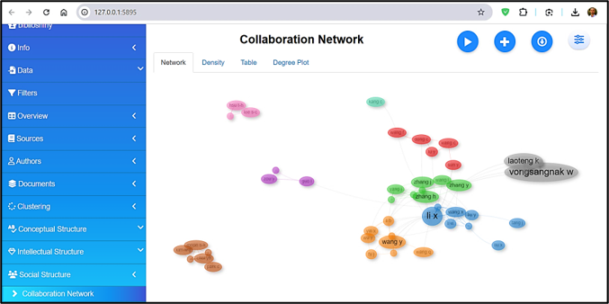{#fig-Figura_25}

En la subcategoría **Social Structure → Countries' Collaboration World Map**, se visualizan las **redes internacionales de colaboración científica** sobre *Cordyceps* y su compuesto activo *cordycepina*. El color azul indica el volumen de publicaciones ---a mayor intensidad, mayor producción---, destacando **China** como el principal nodo y centro de cooperación. Las conexiones con **Estados Unidos, Alemania, Corea del Sur y Australia** evidencian un **patrón transcontinental de investigación** (@fig-Figura_26), que promueve la **transferencia de conocimiento y la consolidación de redes globales** en el estudio de hongos medicinales.

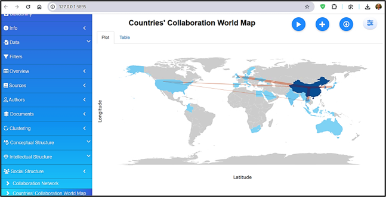{#fig-Figura_26 width="80%"}
