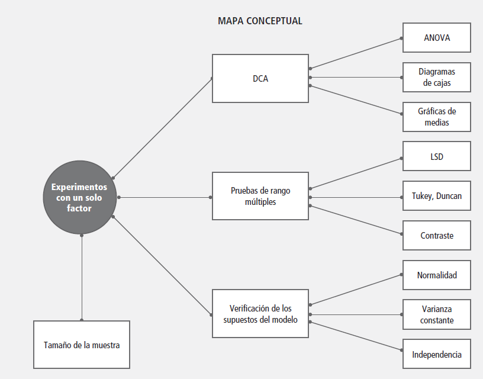
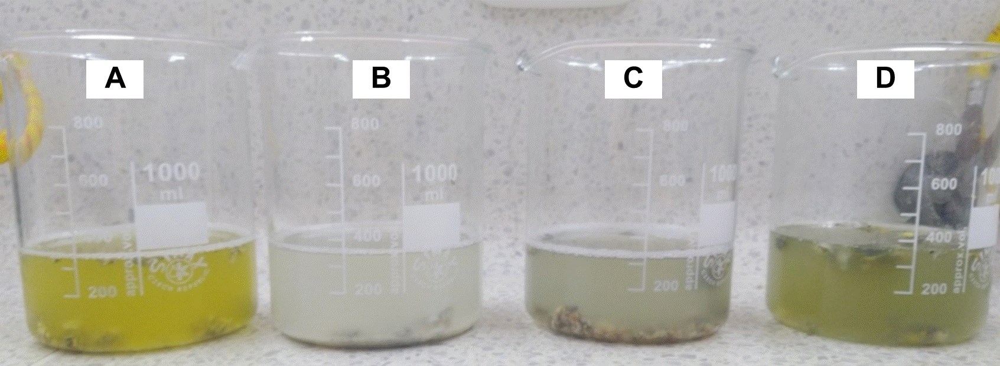

El mapa conceptual (Figura 25) organiza los elementos fundamentales de los **experimentos con un solo factor**. De este tipo de diseños se desprende el **Diseño Completamente al Azar (DCA)**, que utiliza herramientas como el **ANOVA**, los **diagramas de cajas** y las **gráficas de medias** para analizar las diferencias entre tratamientos.

Tras el ANOVA, pueden aplicarse **pruebas de comparación múltiple**, como **LSD**, **Tukey** o **Duncan**, así como contrastes específicos para identificar tratamientos que difieren entre sí.

Además, el diseño requiere la **verificación de los supuestos del modelo**, entre ellos la normalidad, la homogeneidad de varianzas y la independencia de los errores. Finalmente, se considera también el **tamaño de la muestra**, que influye en la precisión y potencia del experimento.

## **Modelo teórico para el Diseño Completamente al Azar (DCA)**

El **Diseño Completamente al Azar (DCA)** se utiliza cuando las unidades experimentales son homogéneas y los tratamientos se asignan completamente al azar [@gutierrez2012analisis; @Montgomery2017], sin ningún tipo de agrupación o bloqueo. El modelo lineal aditivo general se expresa como:

$$
Y_{ij} = \mu + \tau_i + \varepsilon_{ij} 
$$ donde:

-   $Y_{ij}$: valor observado del tratamiento $i$ en la repetición $j$

-   $\mu$: media general

-   $\displaystyle \tau_i$: efecto del tratamiento $i$

-   $\displaystyle \varepsilon_{ij}$: error aleatorio asociado, asumido $\displaystyle \varepsilon_{ij} \sim N(0,\sigma^2)$

El objetivo principal es comparar las medias poblacionales de los tratamientos para determinar si existen diferencias significativas entre ellos. En términos estadísticos, al comparar $k$ tratamientos, la hipótesis fundamental es:

$$
H_0: \mu_1 = \mu_2 = \cdots = \mu_k
$$

frente a la alternativa:

$$
H_A: \mu_i \ne \mu_j \quad \text{para algún } i \ne j
$$

La estrategia consiste en obtener observaciones de cada tratamiento y aplicar el análisis de varianza (ANOVA) para decidir si las diferencias observadas entre las medias provienen de los tratamientos o simplemente del error experimental.

## Problema

::: callout-note
La **antracnosis del banano** 🍌, causada por *Colletotrichum musae* (Berk. y M.A. Curtis) Arx, representa una problemática fitosanitaria de considerable relevancia económica en la industria bananera mundial, puesto que genera pérdidas postcosecha que oscilan entre el 10 y 80% debido al deterioro de la calidad visual del fruto, dicho patógeno desarrolla lesiones (formación de acérvulos) de coloración marrón oscuro a negro en el epicarpio del fruto, las cuales afectan la calidad visual del fruto [@Vasquez-Castillo2019].

Tradicionalmente, el manejo de esta epifitia se ha fundamentado en la aplicación de fungicidas sintéticos como: tiabendazol, azoxystrobin y trifloxystrobin; no obstante, estas sustancias generan impactos ambientales adversos y residualidad ([@Arias2007], por ello, la búsqueda de alternativas de biocontrol sostenibles ha cobrado especial relevancia, particularmente mediante el uso de extractos fúngicos con propiedades antagónicas.
:::

**Metodología:** El estudio se estructuró a partir del **Diseño Completamente al Azar** para la evaluación de sustratos para la evaluación de la actividad inhibitoria.

### Sustratos de cultivo para *Penicillum* sp.

Se empleó un **Diseño Completamente al Azar** con los siguientes tratamientos: avena en hojuelas, maíz partido, semillas de cebada y arroz blanco (Figura 26). Se prepararon bolsas de polipropileno con cada sustrato, se inocularon con cinco discos de micelio de *Penicillum* sp. (0.5 mm de diámetro) y se incubaron de forma aleatorizada a 22 ± 2 °C durante ocho días. El experimento se realizó por quintuplicado, considerando cada bolsa como una repetición.

**Resultados:** El maíz partido constituyó el sustrato óptimo para la producción conidial de *Penicillium digitatum*, alcanzando valores de Log~10~ 9,13 conidios/mL, seguido de la cebada Log~10~ 8,88 conidios/mL .

Sustratos con Conidios de *Penicillium* sp.

{width="503"}

\
La evaluación in vitro reveló que las concentraciones de extracto crudo de 4,0 al 6,0% generaron Porcentajes de Inhibición del Crecimiento micelial (PICM) del 40 al 50 % respectivamente al quinto día después de la inoculación (ddi) (Figura 27).

Efecto de los tratamientos in vitro frente al crecmiento de *Colletotrichum musae.*

{width="557"}

\
Por otro lado, los ensayos in vivo evidenciaron una mayor eficacia del extracto crudo, donde las concentraciones de 8, 9, 10, 11, 12 y 13% generaron porcentajes de inhibición del área de la lesión (PIAL) de 60, 55, 70, 72, 77 y 80% respectivamente, sugiriendo que Penicillium digitatum podría representar una alternativa viable para el manejo preventivo de la antracnosis del banano (Figura 28).

Efecto in vivo de bananos infectados con *Colletotrichum musae* en los tratamientos.

{width="584"}

**\
Para mayor información puede consultar:** Mejía-Sarmiento, J. S. (2022). Evaluación de Extracto Crudo de Penicillium sp. para la Inhibición del Crecimiento in vitro e in vivo de Colletotrichum musae (Berk. y M. A. Curtis) Arx. Agente Causal de Antracnosis en Banano \[Tesis de pregrado, Universidad de Santander UDES\]. Repositorio Institucional UDES. <https://repositorio.udes.edu.co/handle/001/8674>

### Estructura de la base de datos

La base de datos utilizada en este análisis corresponde a los resultados de un experimento agrícola que evalúa el comportamiento de cuatro cultivos diferentes bajo condiciones similares de manejo. La tabla contiene tres columnas principales:

| Variable | Descripción |
|-----------------------|------------------------------------------------|
| `Tratamiento` | Tipo de cultivo evaluado. Incluye cuatro niveles: Arroz, Avena, Cebada y Maíz. |
| `Repetición` | Número de repetición del tratamiento (del 1 al 4). Permite el análisis estadístico con replicación. |
| `Resultado` | Valor numérico correspondiente a la variable respuesta medida (por ejemplo, rendimiento en kg/ha). |

**Pasos para trabajar con R:**

Especificar el directorio que me interesa donde se encuentra la base de datos.

::: callout-tip
**Antes de inciar:** R lee / (slash o división) y no el de Windows \\

En **R**, `setwd()` es una función que significa **"set working directory"** o "establecer el directorio de trabajo". Se utiliza para **definir la carpeta predeterminada** en la que R buscará archivos para leer y donde guardará archivos por defecto.\

Por ejemplo: setwd ("D:/OneDrive - Universidad de Santander/Material Docente 2025/CodigoR"")
:::

### Cargar las librerias necesarias para el análisis

```{r, warning=FALSE}
suppressPackageStartupMessages({
library(readxl)
library(dplyr)
library(stringr)
library(ggplot2)
library(car)
library(lmtest)
library(agricolae)
library(multcomp)
library(emmeans)
library(multcompView)
})
```

### Importar datos desde Excel

```{r}
library(readxl)
DCA <- read_excel("C:/R-Proyectos/r-para-mi/data/DCA_Penicillium/dca.xlsx")
```

### Exploración inicial y estructura de la base de datos

```{r}
View(DCA)
```

```{r}
head(DCA)
```

```{r}
names(DCA)
```

```{r}
str(DCA)
```

```{r}
summary(DCA$Resultado)
```

**Convertir las variables en factor**

En un diseño experimental, los factores como **Tratamiento** y **Repetición** deben declararse como variables **categóricas (factor).** Esto le indica a R que los niveles de cada variable no son numéricos, sino categorías que representan tratamientos o bloques, permitiendo aplicar correctamente el ANOVA.

```{r}
# Convertir a factor o numérico según corresponda
DCA$Tratamiento <- as.factor(DCA$Tratamiento)
DCA$Repeticion  <- as.factor(DCA$Repeticion)
DCA$Resultado   <- as.numeric(DCA$Resultado)
```

**Análisis de la Varianza - ANOVA**

Cuando se desea saber si varios grupos (Ej. tratamientos) presentan diferencias reales en sus promedios, una de las herramientas estadísticas más utilizadas es el Análisis de la Varianza, conocido como ANOVA. Esta técnica permite examinar si los valores medios de tres o más grupos son lo suficientemente distintos como para concluir que no se trata de simples fluctuaciones aleatorias.

El enfoque de ANOVA se basa en comparar dos tipos de variación: por un lado, l**a variabilidad que se observa entre los distintos grupos**, y por otro, **la variabilidad que existe dentro de cada grupo individual**. Si al analizar los datos se encuentra que la variación entre los grupos supera notablemente la que ocurre dentro de ellos, es razonable pensar que las diferencias en los promedios reflejan algo más que el azar. En cambio, si la variabilidad interna es más pronunciada, entonces es posible que las diferencias observadas no sean significativas y respondan a variaciones normales del comportamiento de los datos.

**Código de R para ANOVA**

```{r, error = TRUE}
modeloDCA <- aov(Resultado ~ Tratamiento + Repeticion, data = DCA)
summary(modeloDCA)
```

**Interpretación:** La prueba ANOVA muestra diferencias significativas entre los tratamientos (p \< 0.001). El valor de F (642.488) indica que la variación entre tratamientos es mucho mayor que la variación dentro de los grupos, lo que sugiere que al menos uno de los tratamientos afecta significativamente el resultado.

**Modelo Lineal**

```{r}
modelo_lm <- lm(Resultado ~ Tratamiento + Repeticion, data = DCA)
summary(modelo_lm)
```

**Interpretación:** El modelo lineal confirma que el tratamiento influye significativamente en los resultados (p \< 0.001). El tratamiento "Arroz" actúa como referencia, con una media estimada de 8.75. Comparado con este:

```         
Avena presenta una media significativamente menor (–0.36, p < 0.001).

Cebada muestra un aumento moderado (+0.13, p < 0.001).

Maíz tiene el mayor incremento (+0.40, p < 0.001).
```

El modelo explica el 99.4% de la variabilidad en los datos (R² = 0.994), y el error estándar residual es bajo (0.0244), lo que indica un ajuste excelente.

**Gráfico Boxplot**

Se toma el Tratamiento para hacer un boxplot utilizando la variable "Resultado", pero primero se transformar en factor la variable Tratamiento:

```{r, message=FALSE,}
library(ggplot2)

DCA$Tratamiento<-factor(DCA$Tratamiento) #transformamos una variable númerica en un factor categórico
ggplot(DCA, aes(x = Tratamiento, y = Resultado, fill=Tratamiento)) + 
  geom_boxplot()
```

**Interpretación:** Las diferencias en las medianas entre tratamientos son claras y consistentes con los resultados del ANOVA y del modelo lineal, lo que sugiere un efecto significativo del tipo de cultivo sobre la variable resultado.

## **Supuestos del modelo**

Antes de interpretar los resultados, se verifican los supuestos de **normalidad, homogeneidad de varianzas** e **independencia de los residuos**.

### **Normalidad**

Para verificar la normalidad de los residuos utilizaremos la prueba de Shapiro-Wilks cuyo script es el siguiente:

```{r, error = TRUE}
shapiro.test(residuals(modeloDCA))
```

**Interpretación:** El test de Shapiro-Wilk aplicado a los residuos del modelo ANOVA devuelve un valor de p = 0.934, que es mucho mayor que 0.05. Esto indica que no hay evidencia estadística para rechazar la hipótesis nula de normalidad. Por lo tanto, se concluye que los residuos del modelo siguen una distribución normal, cumpliendo así uno de los supuestos fundamentales del análisis de varianza.

### **Gráficos para evaluar la normalidad**

Para construir el gráfico QQ (QQ plot) y evaluar la normalidad de los datos, se utiliza la función correspondiente del paquete car. Si no está instalado previamente, es necesario instalar también el paquete auxiliar carData.

```{r}
# Instalación (si es necesario) 
# install.packages ("car") 
# install.packages ("carData") 
# install.packages ("dplyr") 
# install.packages ("purrr")
```

**Cargar los paquetes (librerias)**

```{r, message=FALSE, warning=FALSE}
library(car) #Grafico de QQ plot
library(carData)
library(dplyr)
library(purrr)

qqPlot(modeloDCA)
```

**Interpretación:** El gráfico QQ muestra que los residuos estandarizados del modelo ANOVA se alinean adecuadamente con la línea diagonal, lo que indica que su distribución es aproximadamente normal. La mayoría de los puntos se ubican dentro de la banda de confianza, y no se observan desviaciones sistemáticas. Esta gráfica complementa el resultado del test de Shapiro-Wilks (p = 0.959), confirmando que se cumple el supuesto de normalidad de los residuos en el modelo.

### **Homocedasticidad**

Para evaluar el supuesto de homogeneidad de varianzas entre los grupos (homocedasticidad), se aplicará la prueba de Bartlett, la cual es apropiada cuando los datos provienen de poblaciones aproximadamente normales. Esta prueba contrasta la hipótesis nula de igualdad de varianzas frente a la alternativa de varianzas diferentes. El procedimiento se implementa mediante el siguiente script:

```{r, error = TRUE}
bartlett.test(Resultado ~ Tratamiento, data = DCA)
leveneTest(Resultado ~ Tratamiento, data = DCA)
fligner.test(Resultado ~ Tratamiento, data = DCA)
```

**Interpretación:** Dado que el valor de p es mayor que 0.05 (p = 0.5179), no se rechaza la hipótesis nula. Por tanto, se asume que las varianzas entre los tratamientos son homogéneas, cumpliéndose este supuesto clave para el análisis de varianza y para la aplicación de pruebas a posteriori como LSD.

### Gráfico de residuos vs valores ajustados

```{r}
datos_homocedasticidad <- data.frame(
Valores_Ajustados = fitted(modeloDCA),
Residuos_Std = rstandard(modeloDCA)
)

ggplot(datos_homocedasticidad, aes(x = Valores_Ajustados, y = Residuos_Std)) +
geom_point(alpha = 0.6) +
geom_hline(yintercept = 0, linetype = "dashed", color = "red") +
theme_minimal() +
labs(
title = "Gráfico de Residuos vs Valores Ajustados",
x = "Valores ajustados (predichos)",
y = "Residuos estandarizados"
)

```

### Independencia de residuos

```{r}
dwtest(modeloDCA)
```

**Interpretación:** El resultado del **test de Durbin--Watson** (DW = 1.77; *p* = 0.1387) indica que **no existe evidencia significativa de autocorrelación** entre los residuos del modelo. Dado que el valor de *p* es mayor que 0.05, se **acepta la hipótesis nula de independencia**, lo que significa que los residuos son independientes entre sí y el modelo **cumple con este supuesto del ANOVA**.

## **Pruebas aposteriori**

### Prueba LSD (Least Significant Difference)

Para identificar diferencias específicas entre las medias de los tratamientos, una vez detectada significancia en el análisis de varianza, se aplicará una prueba de comparaciones múltiples a posteriori. En este caso, se empleará la técnica LSD (Least Significant Difference), que permite realizar comparaciones pareadas entre tratamientos asumiendo homogeneidad de varianzas. La implementación de esta prueba requiere la carga del paquete agricolae, utilizando el siguiente script. Instalación si es necesario: install.packages("agricolae"). Carga del paquete: library(agricolae).

```{r, error = TRUE, message=FALSE, warning=FALSE}
library(agricolae)
Grupos <- LSD.test(y = modeloDCA, trt = "Tratamiento", group = T, console = T)
```

**Intrepretación:** La prueba LSD reveló que los cuatro tratamientos presentan diferencias estadísticamente significativas entre sus medias. El tratamiento Maíz obtuvo el mayor rendimiento promedio, seguido por Cebada, Arroz y Avena, en ese orden descendente.

Otra opcion cuando cambiamos el argumento "group" a F (false), se interpreta a mi parecer de forma mas sencilla la diferencia entre las medias. A continuación, se presentan las pruebas de comparaciones múltiples a posteriori aplicadas al modelo de ANOVA ajustado. Se incluyen la prueba LSD, la prueba de Tukey y el test de Scheffé, las cuales permiten identificar diferencias estadísticamente significativas entre los tratamientos evaluados:

```{r, error = TRUE}
Grupos<- LSD.test(y = modeloDCA, trt = "Tratamiento", group = F, console = T)
```

**Interpretación:** todas las diferencias entre tratamientos son altamente significativas (p \< 0.001). Esto confirma que ninguno de los tratamientos comparte una media similar.

### Prueba de Tukey

```{r, error = TRUE}
library(agricolae)

# Prueba de Tukey HSD
HSD.test(modeloDCA, "Tratamiento", group = TRUE, console = TRUE)


```

**Interpretación:** La prueba de Tukey también confirma diferencias estadísticamente significativas en todas las comparaciones, manteniendo control del error familiar. El gráfico generado muestra intervalos de confianza del 95% que no se solapan, lo que respalda visualmente los resultados.

```{r, error = TRUE}
plot(TukeyHSD(modeloDCA))
```

**Interpretación:** El gráfico muestra los intervalos de confianza del 95 % para las diferencias de medias entre los tratamientos, ajustados por comparaciones múltiples (family-wise). Ninguno de los intervalos cruza la línea vertical en cero, lo cual indica que todas las comparaciones entre pares de tratamientos son estadísticamente significativas. La diferencia más grande se observa entre Maíz y Avena, mientras que la más pequeña, aunque significativa, es entre Cebada y Arroz. Este resultado es coherente con los análisis previos (ANOVA, LSD y Scheffé), y respalda que cada tratamiento tiene un efecto significativamente distinto sobre la variable "Resultado".

### Prueba de Scheffé

```{r, error = TRUE}
scheffe.test(modeloDCA, "Tratamiento",console=TRUE)
```

**Interpretación:** A pesar de ser una prueba más conservadora, el test de Scheffé también encontró diferencias significativas entre todos los tratamientos. El análisis agrupó los tratamientos en distintos niveles.Mínima diferencia significativa (Scheffé): 0.0558. Valor crítico de F: 3.4903

**Conclusión general** Las tres pruebas aplicadas (LSD, Tukey y Scheffé) coinciden en que todos los tratamientos difieren significativamente entre sí. El tratamiento con mayor rendimiento fue Maíz, seguido por Cebada, Arroz y Avena, en orden descendente. Esto respalda la conclusión de que el tipo de tratamiento influye de manera significativa sobre la variable respuesta.
