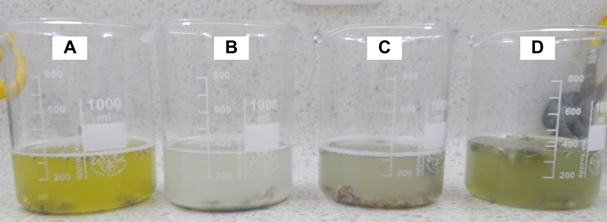

{#fig-DCA}

El mapa conceptual (@fig-DCA) resume los elementos fundamentales de los experimentos con un solo factor. A partir de este enfoque se deriva el Diseño Completamente al Azar (DCA), el cual emplea herramientas estadísticas como el análisis de varianza (ANOVA), diagramas de cajas y gráficos de medias para evaluar diferencias entre tratamientos.

Cuando el ANOVA detecta diferencias significativas entre tratamientos, pueden aplicarse pruebas de comparación múltiple como LSD, Tukey y Scheffé, con el propósito de identificar específicamente cuáles tratamientos difieren entre sí.

Adicionalmente, este diseño requiere verificar los supuestos del modelo estadístico, entre ellos la normalidad de los residuos, la homogeneidad de varianzas y la independencia de los errores. Asimismo, el tamaño de muestra y el número de repeticiones influyen directamente sobre la precisión y potencia experimental.

El **Diseño Completamente al Azar (DCA)** se utiliza cuando las unidades experimentales son homogéneas y los tratamientos son asignados completamente al azar [@gutierrez2012analisis; @Montgomery2017], sin ningún tipo de agrupación o bloqueo. El modelo lineal aditivo general se expresa como:.

$$
Y_{ij} = \mu + \tau_i + \varepsilon_{ij} 
$$ donde:

-   $Y_{ij}$: valor observado del tratamiento $i$ en la repetición $j$

-   $\mu$: media general

-   $\displaystyle \tau_i$: efecto del tratamiento $i$

-   $\displaystyle \varepsilon_{ij}$: error aleatorio asociado, asumido $\displaystyle \varepsilon_{ij} \sim N(0,\sigma^2)$

El objetivo principal del DCA consiste en comparar las medias poblacionales de los tratamientos para determinar si existen diferencias significativas entre ellos. En términos estadísticos, al comparar $k$ tratamientos, se plantean las siguientes hipótesis:

$$
H_0: \mu_1 = \mu_2 = \cdots = \mu_k
$$

frente a la alternativa:

$$
H_A: \mu_i \ne \mu_j \quad \text{para algún } i \ne j
$$

La estrategia experimental consiste en obtener observaciones independientes para cada tratamiento y aplicar el análisis de varianza (ANOVA) con el fin de determinar si las diferencias observadas entre las medias se deben al efecto de los tratamientos o al error experimental.

## Problema

::: callout-note
La antracnosis del banano 🍌, causada por *Colletotrichum musae* (Berk. y M.A. Curtis) Arx, representa una problemática fitosanitaria de alta relevancia económica para la industria bananera mundial. Esta enfermedad genera pérdidas postcosecha que oscilan entre el 10 y el 80%, debido al deterioro de la calidad visual del fruto. El patógeno produce lesiones necróticas y formación de acérvulos de color marrón oscuro a negro sobre el epicarpio, afectando significativamente la apariencia comercial del banano [@Vasquez-Castillo2019].

Tradicionalmente, el manejo de esta epifitia se ha basado en la aplicación de fungicidas sintéticos como tiabendazol, azoxystrobin y trifloxystrobin. Sin embargo, el uso continuo de estas sustancias puede generar impactos ambientales adversos, residualidad química y posibles problemas de resistencia del patógeno [@Arias2007]. En este contexto, la búsqueda de alternativas sostenibles de biocontrol ha cobrado especial relevancia, particularmente mediante el uso de extractos fúngicos con propiedades antagónicas.
:::

**Metodología:** se empleó un *Diseño Completamente al Azar (DCA)* con el fin de evaluar el efecto de distintos sustratos de cultivo sobre la actividad inhibitoria de extractos de *Penicillium* sp. frente a Colletotrichum musae..

### Sustratos de cultivo para *Penicillum* sp.

Se empleó un Diseño Completamente al Azar (DCA) con cuatro tratamientos correspondientes a diferentes sustratos de cultivo: avena en hojuelas, maíz partido, semillas de cebada y arroz blanco (Figura 26). Para cada tratamiento, se prepararon bolsas de polipropileno con el respectivo sustrato, las cuales fueron inoculadas con cinco discos de micelio de *Penicillium* sp. (5 mm de diámetro) e incubadas aleatoriamente a 22 ± 2 °C durante ocho días. El experimento se realizó por cuadruplicado, considerando cada bolsa como una unidad experimental.

**Resultados**: el maíz partido presentó la mayor producción conidial de *Penicillium digitatum*, alcanzando valores de Log~10~ 9,13 conidios/mL, seguido por la cebada con valores de Log~10~ 8,88 conidios/mL. Estos resultados evidencian diferencias en la capacidad de los sustratos para favorecer el crecimiento y la esporulación del hongo. Como se observa en la @fig-sustrato.

Sustratos con conidios de *Penicillium* sp.

{#fig-sustrato}

Dilución de conidios y sustrato, en solución tween80® 0,01%: avena (A); arroz (B); cebada (C); maíz partido (D).

Los ensayos in vitro evidenciaron un efecto inhibitorio dependiente de la concentración del extracto crudo de Penicillium sp. Las concentraciones comprendidas entre 4,0 y 6,0 % alcanzaron porcentajes de inhibición del crecimiento micelial (PICM) entre 40 y 50 % al quinto día después de la inoculación (ddi). Como se observa en la @fig-experimentoinvitro, el incremento en la concentración del extracto estuvo asociado con una mayor inhibición del crecimiento de Colletotrichum musae, lo que sugiere un efecto antifúngico del metabolito evaluado.

{#fig-experimentoinvitro width="80%"}

También se realizaron ensayos in vivo para evaluar el efecto del extracto en frutos infectados; sin embargo, este componente corresponde a una fase aplicada del estudio y no será desarrollado en este apartado, cuyo énfasis se centra en el diseño experimental y el análisis estadístico de los tratamientos.

**Para mayor información puede consultar:** *Mejía-Sarmiento, J. S. (2022). Evaluación de extracto crudo de Penicillium sp. para la inhibición del crecimiento in vitro e in vivo de Colletotrichum musae (Berk. y M. A. Curtis) Arx. agente causal de antracnosis en banano \[Trabajo de grado, Universidad de Santander UDES\]. Repositorio Institucional UDES.* <https://repositorio.udes.edu.co/handle/001/8674>*. Reproducido con autorización del autor.*

### Estructura de la base de datos

La base de datos utilizada en este análisis corresponde a un experimento desarrollado bajo un **Diseño Completamente al Azar (DCA)** para evaluar el efecto de diferentes sustratos de cultivo sobre la producción conidial de *Penicillium* sp. cada tratamiento fue establecido de manera independiente (@tbl-estructura) y distribuido aleatoriamente bajo condiciones controladas de laboratorio.

| Variable | Descripción |
|------------------------------------|------------------------------------|
| `Tratamiento` | Sustrato de cultivo evaluado. Incluye cuatro niveles: arroz blanco, avena en hojuelas, cebada y maíz partido. |
| `Repetición` | Identificador de la unidad experimental correspondiente a cada tratamiento. Cada tratamiento fue evaluado con cuatro repeticiones independientes. |
| `Resultado` | Variable respuesta cuantitativa correspondiente a la producción conidial expresada en Log\~10\~ conidios/mL. |

: Estructura de la base de datos DCA {#tbl-estructura}

**Pasos para trabajar con R:**

Especificar el directorio que me interesa donde se encuentra la base de datos.

::: callout-tip
**Antes de inciar:** R lee / (slash o división) y no el de Windows \\

En **R**, `setwd()` es una función que significa **"set working directory"** o "establecer el directorio de trabajo". Se utiliza para **definir la carpeta predeterminada** en la que R buscará archivos para leer y donde guardará archivos por defecto.\

Por ejemplo: setwd ("D:/OneDrive - Universidad de Santander/Material Docente 2025/CodigoR"")
:::

### Cargar las librerías necesarias para el análisis

```{r, warning=FALSE}
suppressPackageStartupMessages({
library(readr)
library(dplyr)
library(stringr)
library(ggplot2)
library(car)
library(lmtest)
library(agricolae)
library(multcomp)
library(emmeans)
library(multcompView)
})
```

### Importar la base de datos

```{r}
ruta_dca <- "./data/DCA_Penicillium/dca.csv"

if (!file.exists(ruta_dca)) {
  stop("No se encontró el archivo: ", ruta_dca)
}

DCA <- read_delim(
  ruta_dca,
  delim = ";",
  show_col_types = FALSE,
  trim_ws = TRUE
)
```

### Exploración inicial y estructura de la base de datos

```{r}
glimpse(DCA)
```

```{r}
head(DCA)
```

```{r}
names(DCA)
```

```{r}
str(DCA)
```

```{r}
summary(DCA$Resultado)
```

### Convertir las variables en factor

En un diseño experimental, variables como `tratamiento` deben declararse como variables categóricas (*factor*), ya que sus niveles representan categorías experimentales y no valores numéricos continuos. Esto permite que R interprete correctamente la estructura del experimento y aplique adecuadamente el análisis de varianza (ANOVA).

La variable `Repeticion` puede mantenerse como identificador de las unidades experimentales, facilitando la organización y trazabilidad de los datos durante el análisis.

```{r}

DCA$Tratamiento <- dplyr::recode(
  DCA$Tratamiento,
  "Maiz" = "Maíz"
)

# Conversión de variables
DCA$Tratamiento <- as.factor(DCA$Tratamiento)
DCA$Repeticion  <- as.factor(DCA$Repeticion)
DCA$Resultado   <- as.numeric(DCA$Resultado)
```

## Modelo lineal

Con el fin de estimar el efecto de cada tratamiento sobre la variable respuesta y cuantificar las diferencias entre los sustratos evaluados, se ajustó un modelo lineal utilizando la función `lm()` de R.

Este modelo permite obtener los coeficientes asociados a cada tratamiento, tomando uno de ellos como referencia, así como evaluar la magnitud y dirección de los efectos observados. El modelo se ajustó mediante el siguiente código:

```{r}
modelo_lm <- lm(Resultado ~ Tratamiento, data = DCA)
summary(modelo_lm)
```

**Interpretación:** el modelo lineal evidenció que el tipo de sustrato influye significativamente sobre la producción conidial de *Penicillium* sp. (*p* \< 0.001). En el modelo, el tratamiento de referencia corresponde al arroz, con una media estimada de 8.73 Log\~10\~ conidios/mL.

En comparación con este tratamiento:

-   La avena presentó una disminución significativa en la producción conidial (–0.36 Log\~10\~ conidios/mL; *p* \< 0.001).

-   La cebada mostró un incremento moderado y significativo (+0.13 Log\~10\~ conidios/mL; *p* \< 0.001).

-   El maíz presentó el mayor incremento en la producción conidial (+0.40 Log\~10\~ conidios/mL; *p* \< 0.001).

El modelo explicó el 99.4 % de la variabilidad observada en los datos (R² = 0.994), indicando un ajuste excelente. Asimismo, el bajo error estándar residual (0.0244) sugiere una reducida dispersión de los datos alrededor de las medias estimadas.

El estadístico global del modelo fue altamente significativo (*F* = 660.4; *p* = 1.393 × 10⁻¹³), confirmando diferencias estadísticamente significativas entre los tratamientos evaluados.

### Análisis de la varianza - ANOVA

Cuando se desea determinar si existen diferencias estadísticamente significativas entre los promedios de varios tratamientos, una de las herramientas más utilizadas es el **análisis de la varianza (ANOVA)**. En este caso, el ANOVA permite evaluar si los sustratos de cultivo (arroz blanco, avena en hojuelas, cebada y maíz partido) generan diferencias significativas en la producción conidial de *Penicillium* sp.

El ANOVA compara dos fuentes de variación: la variabilidad observada **entre los tratamientos** y la variabilidad existente **dentro de cada tratamiento**, asociada a las repeticiones experimentales. Si la variación entre tratamientos es mayor que la variación interna, se puede inferir que al menos uno de los sustratos tiene un efecto significativo sobre la variable respuesta.

Para este Diseño Completamente al Azar, el modelo estadístico se define así:

**Código de R para ANOVA**

```{r, error = TRUE}
modeloDCA <- aov(Resultado ~ Tratamiento, data = DCA)
summary(modeloDCA)
```

**Interpretación:** el modelo ANOVA mostró un efecto significativo del tratamiento sobre la variable respuesta (*F* = 660.4; *p* = 1.39 × 10⁻¹³). Estos resultados indican que existen diferencias significativas entre los sustratos evaluados en relación con la producción conidial de *Penicillium* sp.

## Exploración gráfica de los datos

**Gráfico Boxplot**

Con el fin de visualizar la distribución de la variable respuesta en cada tratamiento, se construyó un diagrama de cajas y bigotes (*boxplot*). Este gráfico permite comparar medianas, dispersión de los datos, posibles valores atípicos y diferencias generales entre tratamientos.

Para ello, la variable `tratamiento` se definió como categórica (*factor*) en R:

```{r, message=FALSE,}
library(ggplot2)

DCA$Tratamiento <- as.factor(DCA$Tratamiento)

ggplot(DCA, aes(x = Tratamiento, y = Resultado, fill = Tratamiento)) +
  geom_boxplot() +
  theme_minimal()
```

**Interpretación:** el gráfico boxplot evidenció diferencias claras entre los tratamientos evaluados. El tratamiento Maíz presentó los mayores valores de producción conidial, mientras que Avena mostró los valores más bajos. Asimismo, la dispersión dentro de cada tratamiento fue reducida, lo que sugiere una baja variabilidad experimental y resultados consistentes entre las repeticiones.

## Supuestos del modelo

Antes de interpretar los resultados del modelo lineal y del análisis de varianza (ANOVA), es necesario verificar el cumplimiento de los supuestos estadísticos asociados al modelo. En este estudio se evaluaron los **supuestos de normalidad**, **homogeneidad de varianzas** e **independencia de los residuos**.

### Normalidad

La normalidad de los residuos se evaluó mediante la prueba de Shapiro-Wilk, la cual contrasta la hipótesis nula de que los residuos provienen de una distribución normal. Un valor de *p* mayor a 0.05 indica que no existen evidencias suficientes para rechazar el supuesto de normalidad.

El análisis se realizó utilizando el siguiente script en R:

```{r, error = TRUE}
shapiro.test(residuals(modeloDCA))
```

**Interpretación:** la prueba de Shapiro-Wilk aplicada a los residuos del modelo arrojó un valor de W = 0.979 y un valor de *p* = 0.959, superior al nivel de significancia de 0.05. Por lo tanto, no existen evidencias estadísticas para rechazar la hipótesis nula de normalidad, indicando que los residuos del modelo presentan una distribución aproximadamente normal. En consecuencia, se considera cumplido el supuesto de normalidad requerido para el análisis de varianza (ANOVA).

### Gráficos para evaluar la normalidad

Para construir el gráfico QQ (QQ plot) y evaluar la normalidad de los datos, se utiliza la función correspondiente del paquete car. Si no está instalado previamente, es necesario instalar también el paquete auxiliar carData.

```{r}
# Instalación (si es necesario) 
# install.packages ("car") 
# install.packages ("carData") 
# install.packages ("dplyr") 
# install.packages ("purrr")
```

**Cargar los paquetes (librerias)**

```{r, message=FALSE, warning=FALSE}
library(car) #Grafico de QQ plot
library(carData)
library(dplyr)
library(purrr)

qqPlot(modeloDCA)
```

**Interpretación:** el gráfico QQ muestra que los residuos estandarizados del modelo ANOVA se alinean adecuadamente con la línea diagonal, lo que indica que su distribución es aproximadamente normal. La mayoría de los puntos se ubican dentro de la banda de confianza, y no se observan desviaciones sistemáticas. Esta gráfica complementa el resultado del test de Shapiro-Wilks (p = 0.959), confirmando que se cumple el supuesto de normalidad de los residuos en el modelo.

### Homocedasticidad

La homogeneidad de varianzas entre tratamientos constituye uno de los supuestos fundamentales del análisis de varianza (ANOVA). Para evaluar este supuesto, se aplicó la prueba de Bartlett, la cual resulta apropiada cuando los residuos presentan una distribución aproximadamente normal. Esta prueba contrasta la hipótesis nula de igualdad de varianzas entre los tratamientos frente a la hipótesis alternativa de diferencias en las varianzas.

Adicionalmente, se realizaron las pruebas de Levene y Fligner-Killeen como métodos complementarios de verificación de homocedasticidad, debido a que presentan mayor robustez frente a posibles desviaciones de normalidad.

El análisis se realizó mediante el siguiente script en R:

```{r, error = TRUE}
bartlett.test(Resultado ~ Tratamiento, data = DCA)
leveneTest(Resultado ~ Tratamiento, data = DCA)
fligner.test(Resultado ~ Tratamiento, data = DCA)
```

**Interpretación:** las pruebas de Bartlett (p=0.5179), Levene (p=0.4268) y Fligner-Killeen (p=0.3802) presentaron valores de *p* superiores a 0.05, por lo que no existen evidencias estadísticas para rechazar la hipótesis nula de igualdad de varianzas entre los tratamientos. Estos resultados indican que la variabilidad de los datos es homogénea entre los grupos evaluados, cumpliéndose el supuesto de homocedasticidad requerido para el análisis de varianza (ANOVA) y la aplicación de pruebas de comparación múltiple..

### Gráfico de residuos vs valores ajustados

Como complemento a las pruebas estadísticas de homogeneidad de varianzas, se realizó un gráfico de residuos estandarizados frente a los valores ajustados del modelo. Este gráfico permite evaluar visualmente la presencia de patrones sistemáticos, cambios en la dispersión o posibles problemas de heterocedasticidad.

```{r}
datos_homocedasticidad <- data.frame(
Valores_Ajustados = fitted(modeloDCA),
Residuos_Std = rstandard(modeloDCA)
)

ggplot(datos_homocedasticidad, aes(x = Valores_Ajustados, y = Residuos_Std)) +
geom_point(alpha = 0.6) +
geom_hline(yintercept = 0, linetype = "dashed", color = "red") +
theme_minimal() +
labs(
title = "Gráfico de Residuos vs Valores Ajustados",
x = "Valores ajustados (predichos)",
y = "Residuos estandarizados"
)

```

**Interpretación:** el gráfico de residuos versus valores ajustados mostró una distribución aleatoria de los residuos alrededor de la línea horizontal en cero, sin evidenciar patrones sistemáticos ni cambios importantes en la dispersión. Esto sugiere que la variabilidad de los residuos se mantiene aproximadamente constante a lo largo de los valores ajustados, respaldando el cumplimiento del supuesto de homocedasticidad del modelo.

### Independencia de residuos

La independencia de los residuos constituye otro de los supuestos fundamentales del modelo lineal y del análisis de varianza (ANOVA). Este supuesto establece que los errores experimentales deben ser independientes entre sí, es decir, que el valor de un residuo no debe estar correlacionado con otro.

Para evaluar este supuesto se utilizó la prueba de Durbin-Watson, la cual permite detectar la presencia de autocorrelación en los residuos del modelo. Valores cercanos a 2 indican independencia, mientras que valores próximos a 0 o 4 sugieren autocorrelación positiva o negativa, respectivamente.

El análisis se realizó mediante el siguiente script en R:

```{r}
dwtest(modeloDCA)
```

**Interpretación:** la prueba de Durbin-Watson arrojó un estadístico $DW=1.866$ y un valor de *p* = 0.1238, superior al nivel de significancia de 0.05. Estos resultados indican que no existe evidencia estadísticamente significativa de autocorrelación entre los residuos del modelo. Por lo tanto, se considera cumplido el supuesto de independencia de los errores requerido para el análisis de varianza (ANOVA).

## Pruebas aposteriori

### Prueba LSD (Least Significant Difference)

Una vez identificadas diferencias significativas entre tratamientos mediante el análisis de varianza (ANOVA), se realizaron pruebas de comparaciones múltiples *a posteriori* con el fin de determinar cuáles tratamientos difieren estadísticamente entre sí.

En este estudio se utilizó la prueba LSD (*Least Significant Difference*), la cual permite efectuar comparaciones pareadas entre medias bajo el supuesto de homogeneidad de varianzas previamente verificado. El análisis se realizó utilizando el paquete [agricolae]{.underline} en R mediante el siguiente script:

```{r, error = TRUE, message=FALSE, warning=FALSE}
library(agricolae)
Grupos <- LSD.test(y = modeloDCA, trt = "Tratamiento", group = T, console = T)
```

**Intrepretación:** la prueba LSD (*Least Significant Difference*) evidenció diferencias estadísticamente significativas entre todos los tratamientos evaluados (α=0.05). El tratamiento maíz presentó la mayor producción conidial promedio (9.13 Log\~10\~ conidios/mL), seguido por Cebada (8.86 Log\~10\~ conidios/mL), Arroz (8.73 Log\~10\~ conidios/mL) y Avena (8.38 Log\~10\~ conidios/mL).

El agrupamiento por letras mostró que cada tratamiento pertenece a un grupo estadístico diferente (a, b, c y d), indicando que todas las medias difieren significativamente entre sí. Estos resultados confirman que el tipo de sustrato influye significativamente sobre la producción conidial de *Penicillium* sp., siendo el maíz el sustrato más favorable para el crecimiento y esporulación del hongo.

Cuando el argumento `group = FALSE` es utilizado, la prueba LSD presenta las comparaciones pareadas entre tratamientos de manera individual, facilitando la visualización directa de las diferencias de medias y sus niveles de significancia estadística.

```{r, error = TRUE}
Grupos<- LSD.test(y = modeloDCA, trt = "Tratamiento", group = F, console = T)
```

**Interpretación:** la prueba LSD de comparaciones múltiples mostró que todas las diferencias entre tratamientos fueron estadísticamente significativas (*p* \< 0.001). Esto indica que ninguno de los sustratos evaluados presentó medias similares en términos de producción conidial de *Penicillium* sp.

La mayor diferencia se observó entre los tratamientos avena y maíz (−0.755 Log\~10\~ conidios/mL), evidenciando un comportamiento claramente contrastante entre ambos sustratos. Por otro lado, la menor diferencia, aunque significativa, se presentó entre arroz y cebada (−0.127 Log\~10\~ conidios/mL).

Estos resultados confirman que el tipo de sustrato influye significativamente sobre la producción conidial del hongo, siendo el maíz el tratamiento que favoreció en mayor medida el crecimiento y esporulación de *Penicillium* sp.

### Prueba de Tukey

Con el fin de realizar comparaciones múltiples entre tratamientos controlando el error de tipo I asociado a múltiples comparaciones, se aplicó la prueba de Tukey HSD (*Honestly Significant Difference*). Esta prueba es más conservadora que la prueba LSD y permite identificar diferencias significativas entre pares de medias manteniendo el control del error familiar (*family-wise error rate*).

```{r, error = TRUE}
library(agricolae)

# Prueba de Tukey HSD
HSD.test(modeloDCA, "Tratamiento", group = TRUE, console = TRUE)


```

**Interpretación:** la prueba de Tukey HSD confirmó diferencias estadísticamente significativas entre todos los tratamientos evaluados (α=0.05). El análisis de agrupamiento mostró que cada tratamiento pertenece a un grupo estadístico diferente (a, b, c y d), indicando que ninguna de las medias comparte similitud estadística.

El tratamiento Maíz presentó la mayor producción conidial promedio (9.13 Log\~10\~ conidios/mL), seguido por cebada (8.86 Log\~10\~ conidios/mL), Arroz (8.73 Log\~10\~ conidios/mL) y avena (8.38 Log\~10\~ conidios/mL). La diferencia mínima significativa obtenida mediante la prueba de Tukey fue de 0.0512, confirmando que las diferencias observadas entre tratamientos superan el umbral requerido para considerarse estadísticamente significativas.

Estos resultados corroboran los hallazgos obtenidos mediante el ANOVA y la prueba LSD, evidenciando que el tipo de sustrato influye significativamente sobre la producción conidial de *Penicillium* sp., siendo el maíz el sustrato más favorable para el crecimiento y esporulación del hongo.

```{r, error = TRUE}
plot(TukeyHSD(modeloDCA))
```

**Interpretación:** el gráfico de Tukey HSD muestra los intervalos de confianza del 95 % para las diferencias de medias entre tratamientos, ajustados por comparaciones múltiples (*family-wise error rate*). Ninguno de los intervalos cruza la línea vertical de referencia en cero, indicando que todas las comparaciones pareadas entre tratamientos presentan diferencias estadísticamente significativas.

La mayor diferencia se observó entre los tratamientos maíz y Avena, mientras que la menor diferencia, aunque estadísticamente significativa, se presentó entre cebada y arroz. Estos resultados son consistentes con los análisis previos obtenidos mediante ANOVA y la prueba LSD, confirmando que cada sustrato ejerce un efecto diferencial sobre la producción conidial de *Penicillium* sp.

### Prueba de Scheffé

Como complemento a las pruebas de comparación múltiple, se aplicó el test de Scheffé, una metodología más conservadora para la comparación de medias entre tratamientos. Esta prueba controla de manera estricta el error de tipo I, siendo especialmente útil cuando se desea realizar inferencias robustas sobre diferencias entre grupos experimentales.

El análisis se realizó utilizando el siguiente script en R:

```{r, error = TRUE}
scheffe.test(modeloDCA, "Tratamiento",console=TRUE)
```

**Interpretación:** la prueba de Scheffé confirmó diferencias estadísticamente significativas entre los tratamientos evaluados. A pesar de ser una prueba más conservadora en comparación con LSD y Tukey, los resultados mantuvieron la misma tendencia observada previamente, indicando que los tratamientos presentan medias significativamente diferentes entre sí.

El análisis evidenció que el tratamiento maíz presentó la mayor producción conidial, seguido por cebada, arroz y avena. Estos resultados refuerzan la conclusión de que el tipo de sustrato influye significativamente sobre la producción conidial de *Penicillium* sp.

**Conclusión general**

Las pruebas de comparaciones múltiples LSD, Tukey y Scheffé coincidieron en evidenciar diferencias estadísticamente significativas entre todos los tratamientos evaluados. En todos los casos, el tratamiento Maíz presentó la mayor producción conidial promedio, seguido por cebada, arroz y avena, respectivamente.

La consistencia observada entre las diferentes pruebas estadísticas fortalece la confiabilidad de los resultados obtenidos y confirma que el tipo de sustrato influye significativamente sobre la producción conidial de *Penicillium* sp. En particular, el maíz se identificó como el sustrato más favorable para el crecimiento y esporulación del hongo bajo las condiciones evaluadas.
