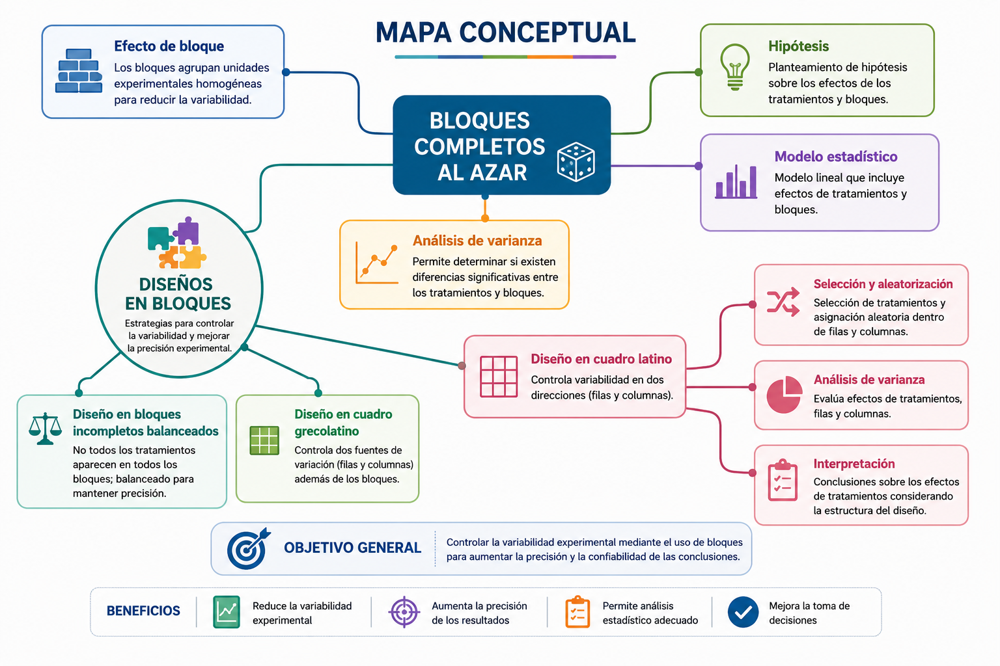
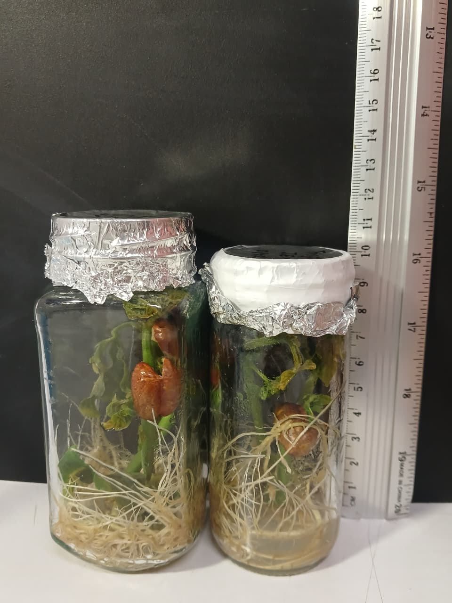

La figura 29 presenta los principales componentes de los **diseños en bloques** (Figura 29), una estrategia experimental usada para controlar la variabilidad mediante la formación de grupos homogéneos llamados *bloques*. Entre estos diseños se encuentra el **Diseño en Bloques Completos al Azar (DBCA)**, el cual incorpora el *efecto de bloque* y requiere definir claramente las **hipótesis**, el **modelo estadístico**, así como la **selección y aleatorización** de las unidades experimentales. El análisis estadístico del DBCA se realiza mediante un **ANOVA de dos vías**, el cual permite evaluar simultáneamente el efecto de los tratamientos y de los bloques sobre la variable respuesta.

Otros diseños relacionados incluyen el **diseño en bloques incompletos balanceados** y los diseños **en cuadro latino** y **grecolatino**, los cuales permiten controlar simultáneamente múltiples fuentes de variación. Cada uno de estos diseños exige un procedimiento estructurado que abarca la formulación del modelo, el análisis de varianza correspondiente y la **interpretación** de los resultados.

## Modelo teórico para el Diseño de Bloques Completamente al Azar (DBCA)

El **Diseño en Bloques Completos al Azar (DBCA)** se utiliza cuando existe una fuente de variación conocida **denominada *bloques*** que puede influir en la variable de respuesta. Para controlar esa variabilidad, las unidades experimentales se agrupan en bloques homogéneos, y dentro de cada bloque los tratamientos se asignan aleatoriamente [@gutierrez2012analisis; @Montgomery2017].

El modelo lineal aditivo correspondiente al DBCA se expresa como:

$$
Y_{ij} = \mu + \tau_i + \beta_j + \varepsilon_{ij}
$$

donde:

-   $Y_{ij}$: valor observado del tratamiento $i$ en el bloque $j$
-   $\mu$: media general
-   $\displaystyle \tau_i$: efecto del tratamiento $i$
-   $\displaystyle \beta_j$: efecto del bloque $j$
-   $\displaystyle \varepsilon_{ij}$: error aleatorio asociado, con $\displaystyle \varepsilon_{ij} \sim N(0,\sigma^2)$

Para ello se formulan las siguientes hipótesis estadísticas:

$$
H_0 : \mu_1 = \mu_2 = \cdots = \mu_k
$$

$$
H_A : \mu_i \ne \mu_j \quad \text{para algún } i \ne j
$$

Estas hipótesis permiten evaluar si existen diferencias significativas entre los tratamientos más allá de la variabilidad explicada por los bloques.

## Análisis de varianza

De acuerdo con [@gutierrez2012analisis], las hipótesis planteadas en las ecuaciones anteriores se evalúan mediante un análisis de varianza de dos vías, debido a que en el DBCA es necesario considerar simultáneamente dos fuentes de variación: los tratamientos y los bloques. La Tabla presenta el formato general del ANOVA correspondiente a un diseño en bloques completos al azar.

### Tabla ANOVA para un diseño en bloques completos al azar

| Fuente de variabilidad | Suma de cuadrados | Grados de libertad | Cuadrado medio | Estadístico F | Valor-p |
|------------|------------|------------|------------|------------|------------|
| Tratamientos | $SC_{TRAT}$ | $k - 1$ | $CM_{TRAT}$ | $F_0 = \frac{CM_{TRAT}}{CM_E}$ | $P(F > F_0)$ |
| Bloques | $SC_B$ | $b - 1$ | $CM_B$ | $F_0 = \frac{CM_{B}}{CM_E}$ | $P(F > F_0)$ |
| Error | $SC_E$ | $(k - 1)(b - 1)$ | $CM_E$ | --- | --- |
| Total | $SC_T$ | $kb - 1$ | --- | --- | --- |

Nota: SC: Suma de cuadrados; CM: Cuadrado medio; $k$: número de tratamientos; $b$: número de bloques. TRAT: Tratamiento.

## Problema

::: callout-note
El crecimiento de las plantas de frijol (*Phaseolus vulgaris*) depende en gran medida de la interacción entre sus raíces y los microorganismos del suelo, especialmente los rizobios, los cuales establecen una relación simbiótica mediante la formación de nódulos radiculares que facilitan la fijación biológica de nitrógeno (FBN). Este proceso constituye una fuente natural y sostenible de nitrógeno, fundamental para el desarrollo y rendimiento del cultivo.

No obstante, la eficiencia de esta simbiosis puede verse afectada por factores edáficos y ambientales como la composición del suelo, la disponibilidad de humedad, la temperatura y la intensidad lumínica, los cuales generan variabilidad en las condiciones experimentales y pueden influir directamente sobre el crecimiento de las plantas y la actividad microbiana asociada.

Debido a esta variabilidad, resulta apropiado emplear un Diseño en Bloques Completos al Azar (DBCA), donde los bloques permiten controlar parcialmente el efecto de factores ambientales no controlados. En este contexto, se evaluó la respuesta del frijol frente a diferentes tratamientos de fertilización que combinan fuentes químicas y biológicas, incluyendo bioinoculantes y abonos orgánicos, con el propósito de identificar diferencias significativas en el crecimiento del cultivo y promover estrategias de manejo más sostenibles (Figura 30)

{width="326"}

Imagen suministrada por el profesor Christian Chacín. Laboratorio de Cultivos Vegetales UDES (2025).
:::

## Estructura de la base de datos

El presente experimento se estructuró bajo un **Diseño en Bloques Completos al Azar (DBCA)** con el objetivo de evaluar el efecto de diferentes tratamientos de fertilización sobre el crecimiento de plantas de frijol (*Phaseolus vulgaris*). Este diseño permite controlar parcialmente la variabilidad asociada a factores ambientales no experimentales mediante la conformación de bloques homogéneos.

Se establecieron tres bloques (A, B y C), dentro de los cuales se asignaron aleatoriamente cuatro tratamientos de fertilización:

-   **NPK comercial;**

-   **NPK + bioinoculante;**

-   **Orgánico + NPK (50:50);**

-   **Orgánico + NPK.**

Cada tratamiento fue evaluado mediante diez observaciones dentro de cada bloque, generando un diseño balanceado con un total de 120 unidades experimentales.

La variable respuesta, denominada `Resultado`, corresponde a una variable cuantitativa continua asociada al crecimiento vegetal, expresada en valores decimales.

## Unidad experimental

> Cada planta de *Phaseolus vulgaris* evaluada dentro de cada combinación tratamiento × bloque constituyó una unidad experimental independiente.

## Definición de bloques

> Los bloques correspondieron a diferentes sectores del área experimental con condiciones ambientales relativamente homogéneas, utilizados para controlar parcialmente la variabilidad asociada a factores externos como humedad, iluminación o características del suelo.

## Descripción de las variables del experimento

El diseño experimental corresponde a un Diseño en Bloques Completos al Azar (DBCA), en el cual se evaluaron diferentes tratamientos de fertilización en plantas de frijol (*Phaseolus vulgaris*). Los bloques representan grupos homogéneos de unidades experimentales, mientras que la variable respuesta cuantifica el efecto de los tratamientos sobre el crecimiento vegetal.

|   | Tipo de variable | Descripción |
|:-----------------------|:-----------------------|:-----------------------|
| **Tratamiento** | Cualitativa nominal | Incluye los diferentes tratamientos de fertilización evaluados: NPK comercial, NPK + bioinoculante, Orgánico + NPK (50:50) y fertilización orgánica. |
| **Bloque** | Cualitativa nominal | Factor de bloqueo que agrupa las unidades experimentales bajo condiciones similares. Los bloques se identifican como A, B y C. |
| **Resultado** | Cuantitativa continua | Variable respuesta asociada al crecimiento de las plantas, expresada en valores decimales (por ejemplo, altura de planta en cm). |

## Instalar Paquetes (solo una vez)

```{r}
#install.packages("readxl")
#install.packages("car") 
#install.packages("agricolae") 
#install.packages("lmtest") 
#install.packages("ggplot2")
#install.packages("gtable")
```

## Cargar las librerias necesarias para el análisis

```{r, warning=FALSE}
suppressPackageStartupMessages({
library(readxl) 
library(car) 
library(agricolae)
library(lmtest) 
library(ggplot2)
})
```

## Importar datos desde Excel

```{r}
library(readxl)
DBCA <- read_excel("C:/R-Proyectos/r-para-mi/data/DBCA_Frijol/DBCA_frijol.xlsx")

DBCA$Tratamiento[DBCA$Tratamiento == "Organico + NPK (50:50)"] <- 
"Orgánico + NPK (50:50)"
```

## Exploración inicial y estructura de la base de datos

```{r}
View(DBCA)
```

```{r}
names(DBCA)
```

```{r}
str(DBCA)
```

```{r}
summary(DBCA$Resultado)
```

## Convertir variables a factores

Para garantizar un análisis adecuado bajo un **Diseño en Bloques Completos al Azar (DBCA)**, las variables `Tratamiento` y `Bloque` deben definirse como factores en R. Esta conversión permite que el modelo estadístico reconozca ambas variables como factores categóricos asociados a los efectos experimentales del estudio, evitando que sean interpretadas como variables numéricas continuas.

La variable `Resultado`, por su parte, se mantiene como una variable cuantitativa continua.

```{r}
DBCA$Tratamiento <- as.factor(DBCA$Tratamiento)
DBCA$Bloque      <- as.factor(DBCA$Bloque)
DBCA$Resultado   <- as.numeric(DBCA$Resultado)
```

## Modelo lineal para DBCA

Con el fin de evaluar simultáneamente el efecto de los tratamientos de fertilización y de los bloques experimentales sobre la variable respuesta, se ajustó un modelo lineal correspondiente al Diseño en Bloques Completos al Azar (DBCA). Este modelo incorpora tanto el efecto de los tratamientos como la variabilidad asociada a los bloques, permitiendo controlar parcialmente las diferencias ambientales presentes en el experimento.

El modelo se ajustó en R mediante el siguiente código:

```{r}
modeloDBCA <- aov(Resultado ~ Tratamiento + Bloque,
                  data = DBCA)

summary(modeloDBCA)
```

## Interpretación

El análisis del modelo lineal evidenció que el factor `Tratamiento` presentó un efecto altamente significativo sobre la variable respuesta ($F = 153.749$; $p < 2 \times 10^{-16}$), indicando que existen diferencias estadísticas entre las medias de los tratamientos evaluados.

Por otro lado, el factor `Bloque` no mostró un efecto significativo ($F = 0.688$; $p = 0.505$), lo que sugiere que la variabilidad entre bloques fue baja y no contribuyó significativamente a explicar la variación observada en el experimento.

En conjunto, los resultados indican que las diferencias detectadas en la altura de las plantas se deben principalmente al efecto de los tratamientos de fertilización y no a variaciones asociadas a los bloques experimentales.

## ANOVA para Diseño de Bloques Completos al Azar -DBCA-

```{r}
modeloDBCA <- aov(Resultado ~ Tratamiento + Bloque, data = DBCA)
summary(modeloDBCA)
```

**Interpretación:** Los resultados del análisis de varianza (ANOVA) correspondientes al Diseño en Bloques Completos al Azar (DBCA) evidenciaron un efecto altamente significativo del factor `Tratamiento` sobre la variable respuesta `Resultado`, mientras que el factor `Bloque` no presentó un efecto estadísticamente significativo.

1\. **Efecto del Tratamiento**.

El análisis indica que el factor Tratamiento es altamente significativo sobre la variable de Resultado. Dado que el valor $\text{p}$ es extremadamente pequeño (denotado por '\*\*\*'), se **rechaza la hipótesis nula** de que no hay diferencias entre las medias de los tratamientos. Esto significa que existe una **diferencia estadísticamente significativa** en el Resultado al menos entre dos de los niveles de Tratamiento. **Grados de Libertad (Df):** 3. **Valor F (F value):** 153.749. **Valor p (**$\text{Pr}(>F)$): $<2 \text{e}-16$ (Menor que $0.001$)

El factor `Tratamiento` mostró diferencias altamente significativas entre sus media ($F=153.749$, $p < 2 \times 10^{-16}$. En consecuencia, se rechaza la hipótesis nula de igualdad de medias entre tratamientos, indicando que al menos uno de los tratamientos de fertilización produjo un efecto diferente sobre el crecimiento de las plantas de frijol.

Estos resultados sugieren que el tipo de fertilización influye significativamente sobre la variable respuesta evaluada.

-   Grados de libertad: $Df=3$

-   Cuadrado medio: $CM_{TRAT} = 1200.6$

-   Estadístico F: $F = 153.749$

-   Valor de p: $p < 2 \times 10^{-16}$

2\. **Efecto del Bloque.**

El factor `Bloque` no presentó diferencias estadísticamente significativas ($F = 0.688$; $p = 0.505$). Esto indica que la variabilidad asociada a los bloques no fue suficientemente grande para afectar significativamente la variable respuesta.

Aunque el bloqueo fue incorporado para controlar posibles fuentes de variación ambiental, los resultados sugieren que las condiciones entre bloques fueron relativamente homogéneas o que el efecto de los tratamientos fue considerablemente mayor que la variabilidad atribuida al bloqueo.

-   Grados de libertad: $Df = 2$

<!-- -->

-   Cuadrado medio: $CM_B = 5.4$

<!-- -->

-   Estadístico F: $F = 0.688$

<!-- -->

-   Valor de p: $p = 0.505$

3\. **Resumen del Modelo.**

El análisis evidenció que el factor `Tratamiento` ejerce una influencia significativa sobre la variable respuesta, mientras que el factor `Bloque` no contribuyó significativamente a explicar la variabilidad observada en los datos.

Dado que el efecto de tratamientos resultó significativo, es necesario realizar pruebas de comparaciones múltiples *a posteriori* (por ejemplo, Tukey, LSD o Scheffé) con el fin de identificar específicamente cuáles tratamientos difieren entre sí.

## Verificación de supuestos

Para garantizar la validez de los resultados del análisis de varianza (ANOVA), es necesario verificar el cumplimiento de los supuestos estadísticos asociados al modelo. El incumplimiento de estos supuestos puede afectar la confiabilidad de las inferencias obtenidas.

Los principales supuestos evaluados fueron:

-   **Normalidad de los residuos:** establece que los residuos del modelo deben aproximarse a una distribución normal. Este supuesto se evaluó mediante la prueba de Shapiro-Wilk y gráficos diagnósticos.

-   **Homogeneidad de varianzas (homocedasticidad):** supone que la variabilidad de la variable respuesta es similar entre los tratamientos y bloques evaluados.

-   **Independencia de las observaciones:** implica que los errores experimentales sean independientes entre sí, sin autocorrelación entre las observaciones.

### Normalidad de residuos (Shapiro-Wilk)

La normalidad de los residuos del modelo se evaluó mediante la prueba de Shapiro-Wilk, la cual contrasta la hipótesis nula de que los residuos provienen de una distribución normal. Valores de $p = 0.505$ indican que no existen evidencias suficientes para rechazar dicho supuesto.

El análisis se realizó mediante el siguiente script en R:

```{r}
res <- residuals(modeloDBCA)
```

```{r}
shapiro.test(res)
```

**Interpretación:** La prueba de Shapiro-Wilk aplicada a los residuos del modelo arrojó un estadístico $W = 0.995$ y un valor de $p = 0.9725$, superior al nivel de significancia de 0.05. Por lo tanto, no existen evidencias estadísticas para rechazar la hipótesis nula de normalidad, indicando que los residuos del modelo presentan una distribución aproximadamente normal. En consecuencia, se considera cumplido el supuesto de normalidad requerido para el análisis de varianza (ANOVA).

**Gráfico Q-Q de los residuos estandarizados**

Como complemento a la prueba de Shapiro-Wilk, se elaboró un gráfico Q-Q (*Quantile-Quantile*) de los residuos estandarizados del modelo. Este gráfico permite evaluar visualmente el supuesto de normalidad mediante la comparación entre los cuantiles observados de los residuos y los cuantiles teóricos de una distribución normal.

Cuando los puntos se distribuyen aproximadamente sobre la línea diagonal de referencia, se considera que los residuos presentan un comportamiento compatible con la normalidad.

El análisis se realizó mediante el siguiente script en R:

```{r}
qqnorm(res)
qqline(res, col = "red")
hist(res, main = "Histograma de residuos", xlab = "Residuos")
```

### Interpretación

El gráfico Q-Q mostró que los residuos estandarizados se distribuyen cercanos a la línea diagonal de referencia, sin evidenciar desviaciones importantes o patrones sistemáticos. Esto sugiere que los residuos presentan una distribución aproximadamente normal, respaldando visualmente el cumplimiento del supuesto de normalidad requerido para el análisis de varianza (ANOVA).

### Homocedasticidad

La homogeneidad de varianzas entre tratamientos constituye uno de los supuestos fundamentales del análisis de varianza (ANOVA). Para evaluar este supuesto se aplicaron las pruebas de Bartlett, Levene y Fligner-Killeen, las cuales permiten determinar si la variabilidad de la variable respuesta es similar entre los grupos evaluados.

El análisis se realizó mediante el siguiente script en R:

```{r}
bartlett.test(Resultado ~ Tratamiento, data = DBCA)
car::leveneTest(Resultado ~ Tratamiento, data = DBCA)
fligner.test(Resultado ~ Tratamiento, data = DBCA)
```

**Interpretación:**

Las pruebas de Bartlett, Levene y Fligner-Killeen presentaron valores de ppp superiores al nivel de significancia de 0.05, indicando que no existen evidencias estadísticas suficientes para rechazar la hipótesis nula de igualdad de varianzas entre tratamientos.

Aunque el valor obtenido en la prueba de Bartlett ($p = 0.059$) se encuentra cercano al umbral de significancia, los resultados en conjunto sugieren que el supuesto de homocedasticidad se cumple razonablemente para el modelo analizado, permitiendo continuar con la interpretación del ANOVA y las pruebas de comparación múltiple.

### Gráfico de Residuos vs. Valores Ajustados

Como complemento a las pruebas formales de homogeneidad de varianzas, se construyó un gráfico de residuos estandarizados frente a los valores ajustados del modelo. Este gráfico permite evaluar visualmente la presencia de patrones sistemáticos, cambios en la dispersión o posibles problemas de heterocedasticidad.

Cuando los residuos se distribuyen aleatoriamente alrededor de la línea horizontal en cero, sin formar estructuras definidas o patrones tipo cono, se considera que el supuesto de homogeneidad de varianzas se cumple adecuadamente.

```{r}
# 1. Extraer valores ajustados y residuos del modelo DBCA
datos_homocedasticidad <- data.frame(
  Valores_Ajustados = fitted(modeloDBCA),     # valores predichos del modelo
  Residuos_Std = rstandard(modeloDBCA)        # residuos estandarizados
)

# 2. Gráfico de residuos vs valores ajustados
ggplot(datos_homocedasticidad, aes(x = Valores_Ajustados, y = Residuos_Std)) +
  geom_point(alpha = 0.6) +
  geom_hline(yintercept = 0, linetype = "dashed", color = "red") +
  theme_minimal() +
  labs(
    title = "Gráfico de Residuos vs. Valores Ajustados (Homogeneidad de Varianzas)",
    x = "Valores ajustados (predichos)",
    y = "Residuos estandarizados"
  )

# Interpretación:
# Los puntos deben dispersarse aleatoriamente alrededor de y = 0
# sin formar patrones o conos, indicando homogeneidad de varianzas.

```

**Interpretación:**

Las pruebas de Bartlett, Levene y Fligner-Killeen, junto con el análisis gráfico de residuos, evidenciaron que el modelo cumple razonablemente el supuesto de homogeneidad de varianzas. El gráfico mostró una dispersión aleatoria de los residuos alrededor de la línea horizontal en cero, sin patrones sistemáticos ni cambios importantes en la variabilidad.

En consecuencia, se considera válido el uso del análisis de varianza (ANOVA) bajo el Diseño en Bloques Completos al Azar (DBCA), dado que no se detectaron violaciones importantes del supuesto de homocedasticidad.

### Independencia de residuos

La independencia de los residuos constituye otro de los supuestos fundamentales del análisis de varianza (ANOVA). Este supuesto establece que los errores experimentales deben ser independientes entre sí, es decir, que el valor de un residuo no debe influir sobre otro.

Para evaluar este supuesto se aplicó la prueba de Durbin-Watson, la cual permite detectar la presencia de autocorrelación entre los residuos del modelo.

Las hipótesis evaluadas fueron:

-   **Hipótesis nula (H₀):** los residuos son independientes;

-   **Hipótesis alternativa (H₁):** los residuos presentan autocorrelación.

Valores de **p-value \> 0.05**, indican que no existen evidencias suficientes para rechazar la hipótesis nula de independencia.

```{r}
dwtest(modeloDBCA)
```

**Interpretación:**

La prueba de Durbin-Watson arrojó un valor de $DW = 2.042$ y un valor de $p = 0.4159$, superior al nivel de significancia de 0.05. En consecuencia, no existen evidencias estadísticas suficientes para rechazar la hipótesis nula de independencia de los residuos.

Adicionalmente, la cercanía del estadístico $DW$ al valor teórico de 2.042 respalda la ausencia de autocorrelación entre los errores experimentales. Por lo tanto, se considera cumplido el supuesto de independencia requerido para la validez del análisis de varianza bajo el Diseño en Bloques Completos al Azar (DBCA).

## **Pruebas aposteriori**

Una vez verificados los supuestos de normalidad, homogeneidad de varianzas e independencia de los residuos, se realizaron pruebas de comparaciones múltiples *a posteriori* con el propósito de identificar cuáles tratamientos presentan diferencias estadísticamente significativas sobre la variable respuesta evaluada.

En el contexto del Diseño en Bloques Completos al Azar (DBCA), estas pruebas permiten comparar las medias ajustadas de los tratamientos considerando el efecto de bloqueo incorporado en el modelo experimental. Entre las pruebas más utilizadas se encuentran Tukey, LSD y Scheffé, las cuales permiten identificar diferencias específicas entre pares de tratamientos.

El uso del DBCA contribuye a reducir la variabilidad experimental asociada a factores externos mediante la conformación de bloques homogéneos, incrementando así la precisión y confiabilidad de las comparaciones estadísticas. En consecuencia, las diferencias detectadas entre tratamientos reflejan principalmente los efectos reales de las condiciones de fertilización evaluadas y no variaciones atribuibles al azar o a fuentes de variación no controladas.

### Tukey HSD (agrupamiento con letras)

```{r}
HSD.test(modeloDBCA, "Tratamiento", group = TRUE, console = TRUE)
```

**Interpretación:**

La prueba de Tukey HSD aplicada al Diseño en Bloques Completos al Azar (DBCA) evidenció diferencias estadísticamente significativas entre todos los tratamientos evaluados sobre la altura de las plantas de frijol. El Tratamiento 4 presentó la mayor media (64.78 cm; grupo a), seguido del Tratamiento 3 (59.71 cm; grupo b), el Tratamiento 2 (54.26 cm; grupo c) y el Tratamiento 1 (50.29 cm; grupo d), el cual registró la menor media.

La diferencia mínima significativa obtenida mediante la prueba de Tukey fue de 1.88, superior a la observada en la prueba LSD (1.43), lo que refleja el carácter más conservador del método Tukey para el control del error por comparaciones múltiples. A pesar de ello, los tratamientos mantuvieron una separación completa, sin letras compartidas entre grupos, indicando que todas las medias difieren significativamente entre sí al nivel de confianza del 95 %.

Estos resultados confirman que los tratamientos ejercieron efectos claramente diferenciados sobre la altura de las plantas y respaldan la consistencia y confiabilidad de los resultados obtenidos en el experimento.

### Comparaciones múltiples con LSD

```{r}
out_LSD <- LSD.test(modeloDBCA, "Tratamiento", group = TRUE, console = TRUE)
```

**Interpretación:**

La prueba LSD (*Least Significant Difference*) aplicada al Diseño en Bloques Completos al Azar (DBCA) evidenció diferencias estadísticamente significativas entre las medias de altura de las plantas de frijol para todos los tratamientos evaluados. El Tratamiento 4 presentó la mayor altura promedio (64.78 cm; grupo a), seguido del Tratamiento 3 (59.71 cm; grupo b), el Tratamiento 2 (54.26 cm; grupo c) y finalmente el Tratamiento 1 (50.29 cm; grupo d), el cual registró la menor media.

La diferencia mínima significativa obtenida mediante la prueba LSD fue de 1.43, indicando que diferencias superiores a este valor se consideran estadísticamente significativas al nivel de confianza del 95 %. La ausencia de letras compartidas entre tratamientos confirma que todas las medias difieren significativamente entre sí.

Estos resultados indican que los tratamientos ejercieron efectos diferenciados sobre la altura de las plantas de frijol, más allá de la variabilidad experimental controlada mediante los bloques del diseño.

### Visualización de resultados

### Caja y Bigote (Boxplot en ggplot2)

```{r}
ggplot(DBCA, aes(x = Tratamiento, y = Resultado, fill = Tratamiento)) + geom_boxplot() + theme_minimal() + labs( title = "Distribución del resultado por tratamiento", x = "Tratamiento", y = "Resultado")
```

**Interpretación:**

La gráfica de cajas y bigotes muestra la distribución de las alturas de las plantas de *Phaseolus vulgaris* bajo los diferentes tratamientos de fertilización evaluados mediante un Diseño en Bloques Completos al Azar (DBCA). Se observa una tendencia creciente en las medianas de los tratamientos, evidenciando un efecto progresivamente favorable sobre el crecimiento vegetal desde NPK Comercial hasta Orgánico + NPK.

El tratamiento Orgánico + NPK presentó las mayores alturas promedio, seguido de Orgánico + NPK (50:50), NPK + Bioinoculante y finalmente NPK Comercial, el cual registró los valores más bajos. La dispersión de los datos dentro de cada tratamiento fue relativamente homogénea, aunque se identificó un valor atípico en el tratamiento Orgánico + NPK (50:50), comportamiento frecuente en experimentos biológicos debido a la variabilidad natural entre individuos.

Estos resultados son consistentes con las pruebas de comparación múltiple (LSD y Tukey), las cuales evidenciaron diferencias estadísticamente significativas entre todos los tratamientos evaluados.
