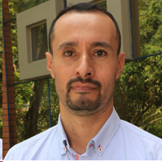
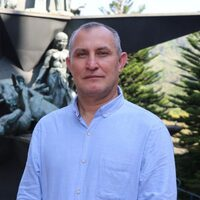

# Autores

::: callout-tip
{width="149"}

## Fredy Alejandro Ortiz Meneses {width="23" height="27"}

Microbiólogo con énfasis en alimentos, especialista en pedagogía y didácticas específicas y magíster en fitopatología. Vinculado a la Universidad de Santander (UDES) desde 2016, como profesor de los cursos de microbiología II y microbiología general del programa de Microbiología Industrial. Es investigador júnior reconocido por MinCiencias en la convocatoria 957 del 2024 y miembro del grupo de investigación MICROBIOTA.
:::

::: callout-tip
{width="149"}

## Miguel Oswaldo Pérez Pulido {width="26" height="28"}

Licenciado en matemáticas y magíster en estadística. Actualmente se desempeña como Director de Analítica Académica, adscrito a la Vicerrectoría de Enseñanza. Está vinculado a la Universidad de Santander (UDES) desde 2011, donde ha sido docente en programas de pregrado y posgrado de la Facultad de Ciencias Exactas, Naturales y Agropecuarias. Es investigador asociado reconocido por MinCiencias en la convocatoria 957 de 2024 y miembro del grupo de investigación CIBAS.
:::

::: callout-tip
{width="149"}

## Francisco Javier León {width="26" height="28"}

Bacteriólogo y laboratorista clínico, con formación avanzada como magíster en estadística aplicada, Magíster en ciencias básicas biomédicas y especialista en educación con nuevas tecnologías. Está vinculado a la Universidad de Santander (UDES) desde 2007, donde ha sido docente en la Facultad de Ciencias Exactas, Naturales y Agropecuarias. Actualmente, se desempeña como Coordinador de Analítica Académica, adscrito a la Vicerrectoría de Enseñanza. Es investigador júnior reconocido por MinCiencias en la convocatoria 957 de 2024 y miembro del grupo de investigación CIBAS.
:::
